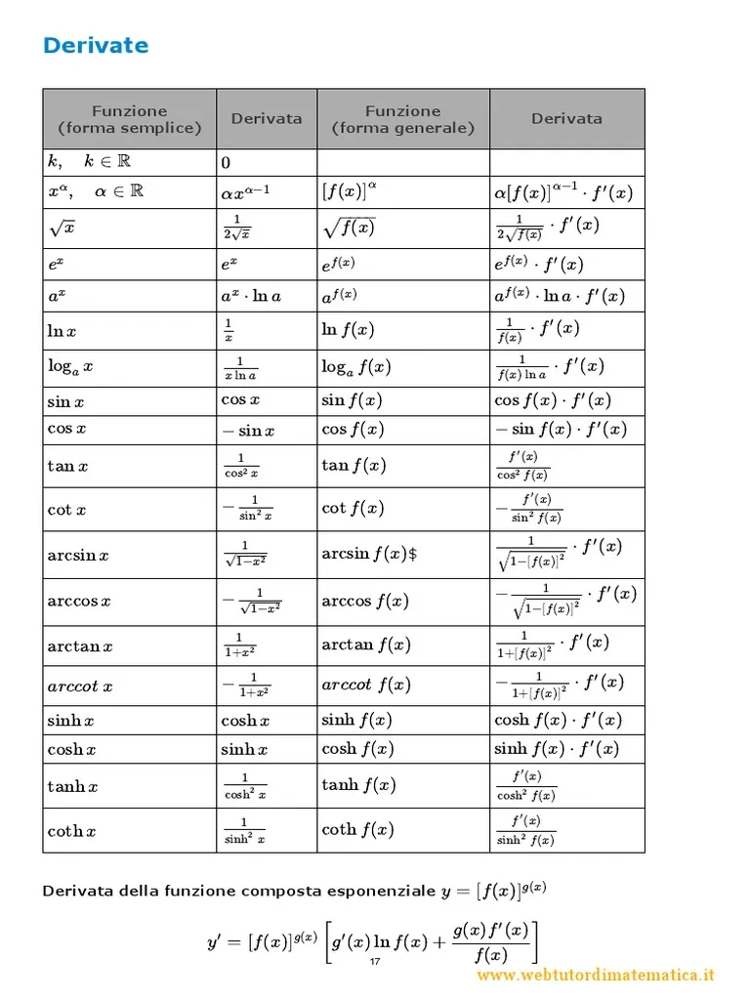
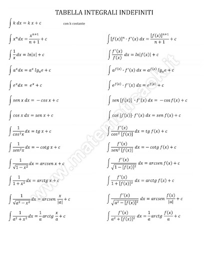

#Analisi

# Primo Esercizio
#### Dominio di una funzione

#### Asintoti
- *Orizzontali*: $y = y_{0}$ se $\lim_{x \to \infty} f(x) = y_{0}$ 
- *Verticali*: $x = x_{0}$ se $\lim_{x \to x_{0}} f(x) = \infty$
- *Obliqui*: $y = mx + q$ con $m = \lim_{x \to \infty} \frac{f(x)}{x}$, $q = \lim_{x \to \infty} f(x) - mx$ 

#### Simmetrie
- *Pari*: $f(-x) = f(x)$
- *Dispari*: $f(-x) = -f(x)$

#### Derivate

- Derivata prima per *monotonia*
	- $f'(x) > 0 \to f$ crescente
	- $f'(x) < 0 \to f$ decrescente

- Derivata seconda per *concavità*
	- $f''(x) > 0 \to f$ convessa $\bigcup$  
	- $f''(x) < 0 \to f$ concava  $\bigcap$ 
	- Punti di flesso $f''(x) = 0$

- *Massimi e minimi*: Studiare segno di $f'$, dove la funzione è crescente $\to$ *massimo relativo*, dove la funzione è decrescente $\to$ *minimo relativo*
- *Intersezioni*: con gli assi $x$ e $y$ trovando rispettivamente $f(x) = 0$ e $f(0)$

#### Retta tangente a f, parallela a una retta assegnata
1. Trova il *coefficiente angolare* della retta assegnata
	- Porta l'equazione nella forma $y=mx + q$
	- Esempio: da $8x - 2y = 5$, ricava $y = 4x - \frac{5}{2}$, quindi $m=4$

2. Imponi che la tangente abbia stessa pendenza
	- Cerca $x_{1}$ tale che $f'(x_{1}) = m$
	- Risolvi l'equazione: $$f'(x) = m$$

3. Scrivi l'equazione della retta tangente:
	- Generica: $$y = f'(x_{1})(x - x_{1}) + f(x_{1})$$
4. Se richiesto, usa il punto specifico (uno dei $x_{1}$) per la tangente richiesta

#### Intervallo I di biiettività (funzione iniettiva e suriettiva)
1. Studia la *monotonia* su possibii intervalli:
	- Individua dove $f'(x)$ è strettamente positivo o negativo

2. Assicurati che la funzione sia *continua*
3. Analizza il comportamento agli *estremi dell'intervallo*:
	- Calcola $\lim_{x \to a^{+}} f(x)$ e $\lim_{x \to b^{-}} f(x)$, (con $a, b$ estremi di $I$)
	- Se i limiti coprono $\mathbb{R}$, per il teorema dei valori intermedi la funzione sarà suriettiva

4. Conclusione:
	- Se su $I, f$ è strettamente monotona, continua e ha limiti che arrivano rispettivamente a $-\infty$ e $+\infty$, allora su quell'intervallo la funzione è biunivoca da $I$ a $\mathbb{R}$ 

# Secondo Esercizio

#### Taylor

Se $x_{0} \ne 0$, sostituire $t = x - x_{0}$   

## Terzo esercizio
#### Integrali

#### Convergenza e Divergenza
Un integrale improprio $\int_{a}^{b} f(x) dx$ *converge* se il limite che definisce l'integrale *esiste ed è finito*. *Diverge* se il limite è *infinito o non esiste*

**Con quali valori di $\alpha$ converge l'integrale?**
Forma del tipo: $$\int_{a}^{b} \frac{1}{x^{\alpha}} dx, \quad a \geq 0, \quad b \to +\infty \quad \text{oppure} \quad b \to 0^{+}$$
**Regole di convergenza**
Integrale improprio in $+\infty$
$$\int_{1}^{+\infty} \frac{1}{x^{\alpha}} dx \quad \text{converge se} \quad \alpha > 1$$
$$\int_{1}^{+\infty} \frac{1}{x^{\alpha}} dx \quad \text{diverge se} \quad \alpha \leq 1$$
Integrale improprio in $0$
$$\int_{0}^{1} \frac{1}{x^{\alpha}} dx \quad \text{converge se} \quad \alpha < 1$$
$$\int_{0}^{1} \frac{1}{x^{\alpha}} dx \quad \text{diverge se} \quad \alpha \geq 1$$

## Quarto Esercizio
#### Cauchy
**Schema Risolutivo**
1. Individua la *forma dell'equazione*:
	- Se è del tipo $y'(x) + p(x)y(x) = q(x) \to$ equazione lineare
	- Se separabili: *riordina* per avere $y' = f(x)g(y)$

2. Riordina e scrivi l'equazione nella forma risolvibile
	- Se lineare: porta tutte le $y$ da una parte
	- Se separabile: isola i termini in $y$ e in $x$

3. Calcola *l'integrale generale*:
	$$y(x) = e^{\int p(x)dx} [\int q(x) \cdot e^{\int p(x)dx} dx + C]$$
4. Applica la *condizione iniziale*:
	- Sostituisci $x_{0}$ e il valore dato $y(x_{0}) = y(0)$, risolvi per la costante $C$

**Domande del tipo: "L'equazione y(x) = n ha almeno una soluzione in" $(\alpha, \beta)$?** 
1. Calcola la funzione soluzione
2. Verifica se il valore cercato è compreso nell'immagine della funzione
3. Applica il teorema dei valori intermedi se la soluzione generale è continua e prende tutti i valori richiesti nell'intervallo dato

