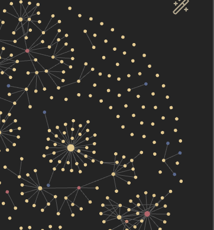

#Algoritmi

- Algoritmi ricorsivi: come analizzarli?
- Complessità di algoritmi ricorsivi e equazioni di ricorrenza
- Una tecnica di progettazione algoritmica: [divide et impera](Argomenti/divide%20et%20impera.md) 
- Metodi per risolvere equazioni di ricorrenza:
1) Iterazione
2) Albero della ricorsione
3) [Sostituzione](../../../../Altri%20Argomenti/Sostituzione.md)
4) Teorema Master
5) Cambiamento di variabile

