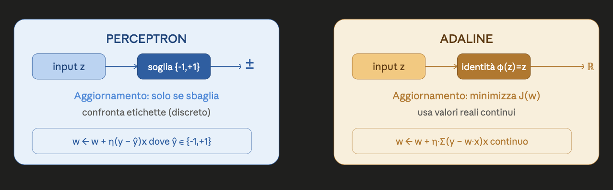
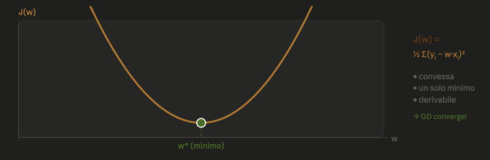
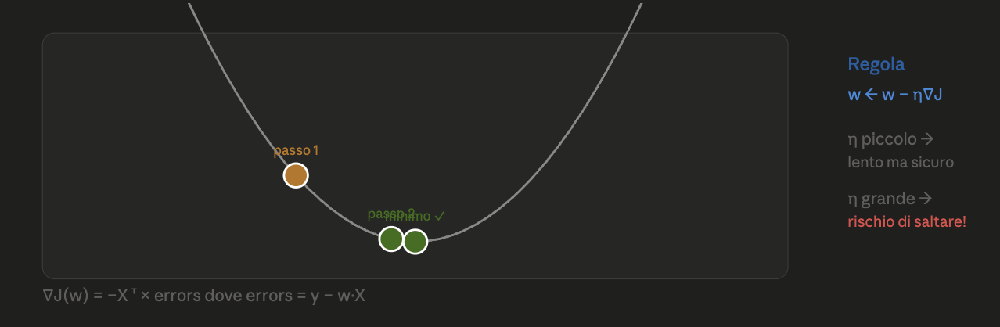

## 1. Cos'è Adaline?

**ADALINE** = **ADA**ptive **LI**near **NE**uron.

A differenza del Perceptron (che usa una funzione soglia discreta), Adaline usa come funzione di attivazione la **funzione identità**:

$$
\phi(z) = \phi(\mathbf{w} \cdot \mathbf{x}) = \mathbf{w} \cdot \mathbf{x}
$$



L'idea chiave: se $(y^{(i)} - \mathbf{w} \cdot \mathbf{x}^{(i)})^2$ è vicino a 0, allora il valore predetto è vicino a quello reale → stessa classe. Minimizzare questo errore è l'obiettivo.

---

## 2. Funzione di Costo — Somma degli Errori Quadrati (SSE)

$$
J(\mathbf{w}) = \frac{1}{2} \sum_{i=1}^{n} \left( y^{(i)} - \mathbf{w} \cdot \mathbf{x}^{(i)} \right)^2
$$

Il fattore $\frac{1}{2}$ è puramente per comodità algebrica (si cancella quando si deriva).

> **Attenzione:** valori predetti grandi in modulo aumentano J anche se la classificazione è corretta. Adaline quindi minimizza la **distanza** tra predetto e target, non solo gli errori di classe.

Proprietà fondamentali di J:
- **Convessa** → un solo minimo globale
- **Derivabile** → si può usare la discesa del gradiente
- **Garantisce convergenza** (con η abbastanza piccolo)




## 3. Discesa del Gradiente



Vogliamo trovare $\mathbf{w}^*$ che minimizza $J(\mathbf{w})$. La regola di aggiornamento è:

$$
\mathbf{w} \leftarrow \mathbf{w} + \Delta\mathbf{w} = \mathbf{w} - \eta \, \nabla J(\mathbf{w})
$$

### Calcolo del gradiente

$$
\frac{\partial J}{\partial w_j} = \frac{\partial}{\partial w_j} \frac{1}{2} \sum_{i=1}^{n} \left( y^{(i)} - \mathbf{w} \cdot \mathbf{x}^{(i)} \right)^2
$$

Applicando la regola della catena:

$$
= \sum_{i=1}^{n} \left( y^{(i)} - \mathbf{w} \cdot \mathbf{x}^{(i)} \right) \cdot \frac{\partial}{\partial w_j}\left( y^{(i)} - \sum_{k=1}^{d} w_k x_k^{(i)} \right)
$$

$$
= \sum_{i=1}^{n} \left( y^{(i)} - \mathbf{w} \cdot \mathbf{x}^{(i)} \right) \cdot (-x_j^{(i)})
$$

$$
= -\sum_{i=1}^{n} x_j^{(i)} \left( y^{(i)} - \mathbf{w} \cdot \mathbf{x}^{(i)} \right)
$$

### Forma vettoriale

Definiamo il vettore degli errori:

$$
\texttt{errors} = \begin{pmatrix} y^{(1)} - \mathbf{w} \cdot \mathbf{x}^{(1)} \\ \vdots \\ y^{(n)} - \mathbf{w} \cdot \mathbf{x}^{(n)} \end{pmatrix}
$$

Allora:

$$
\nabla J(\mathbf{w}) = -X^\top \times \texttt{errors}
$$

E l'aggiornamento diventa:

$$
\mathbf{w} \leftarrow \mathbf{w} + \eta \cdot X^\top \times \texttt{errors}
$$

### Confronto regole di aggiornamento

| Algoritmo | Regola |
|---|---|
| **Perceptron** | $w_j \leftarrow w_j + \eta \,(y^{(i)} - \hat{y}^{(i)})\, x_j^{(i)}$ con $\hat{y}^{(i)} \in \{-1,+1\}$ |
| **Adaline** | $w_j \leftarrow w_j + \eta \sum_{i=1}^{n} (y^{(i)} - \mathbf{w} \cdot \mathbf{x}^{(i)})\, x_j^{(i)}$ con valori reali |

La struttura si somiglia, ma in Adaline $\mathbf{w} \cdot \mathbf{x}^{(i)}$ è un numero reale continuo, non un'etichetta discreta.

---

## 4. Iperparametri — Learning Rate η

La convergenza dipende dalla scelta di η:

```
η troppo GRANDE:               η troppo PICCOLO:
  J(w)                           J(w)
   |  /\    /\                    |╲
   | /  \  /  \  ← oscilla        | ╲_
   |/    \/    \  o diverge       |   ╲____ ← lentissimo,
   └──────────────  w             |         potrebbe non
                                  └──────── convergere mai
```

In pratica:
- η grande → rischio di saltare il minimo e **divergere**
- η piccolo → convergenza lenta → rischio di bloccarsi prima del minimo se `n_iter` è troppo basso

---

## 5. Implementazione Python — Classe Adaline

```python
class AdalineGD(object):
    def __init__(self, eta=0.01, n_iter=50, random_state=1):
        self.eta = eta
        self.n_iter = n_iter
        self.random_state = random_state

    def fit(self, X, y):
        rgen = np.random.RandomState(self.random_state)
        # pesi inizializzati con valori casuali piccoli
        self.w_ = rgen.normal(loc=0.0, scale=0.01, size=1 + X.shape[1])
        self.cost_ = []

        for i in range(self.n_iter):
            net_input = self.net_input(X)   # z = X·w + b
            output = self.activation(net_input)  # φ(z) = z (identità)
            errors = (y - output)           # errori reali
            self.w_[1:] += self.eta * X.T.dot(errors)  # aggiorna pesi
            self.w_[0]  += self.eta * errors.sum()       # aggiorna bias
            cost = (errors**2).sum() / 2.0
            self.cost_.append(cost)
        return self

    def net_input(self, X):
        return np.dot(X, self.w_[1:]) + self.w_[0]  # z = w·x + b

    def activation(self, X):
        return X  # funzione identità!

    def predict(self, X):
        return np.where(self.activation(self.net_input(X)) >= 0.0, 1, -1)
```

> `w_[0]` è il bias (termine noto). Il suo aggiornamento usa `errors.sum()` perché corrisponde alla colonna di 1 nella matrice $X$.

---

## 6. Regressione Logistica

### Motivazione

Adaline produce valori reali. Vogliamo invece una **probabilità**: quanto è probabile che questo campione appartenga alla classe positiva?

Sia $p = Pr(y=1 \mid \mathbf{x})$. Vogliamo collegare $z = \mathbf{w} \cdot \mathbf{x} \in (-\infty, +\infty)$ a $p \in [0,1]$.

### Dalla probabilità alla sigmoide

Definiamo le **odds** (quota):

$$
\text{odds} = \frac{p}{1-p} \in [0, +\infty)
$$

Prendendo il logaritmo otteniamo il **logit**:

$$
\text{logit}(p) = \log\!\left(\frac{p}{1-p}\right) \in (-\infty, +\infty)
$$

Poiché $z$ ha lo stesso dominio, poniamo $\text{logit}(p) = z$ e **invertiamo**:

$$
\frac{p}{1-p} = e^z \;\Rightarrow\; p(1 + e^z) = e^z \;\Rightarrow\; \boxed{p = \frac{1}{1 + e^{-z}}}
$$

Questa è la **funzione sigmoide logistica** $\phi(z)$.

---

## 7. La Funzione Sigmoide come Attivazione

$$
\phi(\mathbf{w} \cdot \mathbf{x}) = \frac{1}{1 + e^{-\mathbf{w} \cdot \mathbf{x}}} = Pr(y = 1 \mid \mathbf{x})
$$

Funzione di classificazione:

$$
\hat{y}(\mathbf{w} \cdot \mathbf{x}) = \begin{cases} 1 & \text{se } \phi(\mathbf{w} \cdot \mathbf{x}) > 0.5 \\ 0 & \text{altrimenti} \end{cases}
$$

Poiché $\phi(z) > 0.5 \Leftrightarrow z > 0$, questo equivale alla stessa soglia di Adaline:

$$
\hat{y} = \begin{cases} 1 & \text{se } \mathbf{w} \cdot \mathbf{x} > 0 \\ 0 & \text{altrimenti} \end{cases}
$$

> Le etichette sono $\{0, 1\}$ (non $\{-1, +1\}$) per motivi che diventeranno chiari con la funzione di costo.

---

## 8. Funzione di Costo — Log-Verosimiglianza

### Verosimiglianza del singolo campione

L'espressione seguente misura la probabilità di classificare correttamente il campione $i$:

$$
\phi(\mathbf{w} \cdot \mathbf{x}^{(i)})^{y^{(i)}} \cdot \left(1 - \phi(\mathbf{w} \cdot \mathbf{x}^{(i)})\right)^{1 - y^{(i)}}
$$

- Se $y^{(i)} = 1$: vale $\phi(\mathbf{w} \cdot \mathbf{x}^{(i)}) = Pr(y=1 \mid \mathbf{x})$
- Se $y^{(i)} = 0$: vale $1 - \phi(\mathbf{w} \cdot \mathbf{x}^{(i)}) = Pr(y=0 \mid \mathbf{x})$

### Verosimiglianza totale

Assumendo i campioni indipendenti:

$$
L(\mathbf{w}) = \prod_{i=1}^{n} \phi(\mathbf{w} \cdot \mathbf{x}^{(i)})^{y^{(i)}} \cdot \left(1 - \phi(\mathbf{w} \cdot \mathbf{x}^{(i)})\right)^{1-y^{(i)}}
$$

### Log-verosimiglianza (da massimizzare)

$$
\ell(\mathbf{w}) = \sum_{i=1}^{n} \left[ y^{(i)} \log\phi(\mathbf{w} \cdot \mathbf{x}^{(i)}) + (1-y^{(i)}) \log\left(1-\phi(\mathbf{w} \cdot \mathbf{x}^{(i)})\right) \right]
$$

### Funzione di costo (da minimizzare)

Cambiando segno:

$$
J(\mathbf{w}) = -\sum_{i=1}^{n} \left[ y^{(i)} \log\phi(\mathbf{w} \cdot \mathbf{x}^{(i)}) + (1-y^{(i)}) \log\left(1-\phi(\mathbf{w} \cdot \mathbf{x}^{(i)})\right) \right]
$$

---

## 9. Derivazione del Gradiente — Regressione Logistica

Calcoliamo la derivata di $\ell_i(\mathbf{w})$ rispetto a $w_j$:

$$
\frac{d}{d w_j} \ell_i(\mathbf{w}) = \left( \frac{y^{(i)}}{\phi} - \frac{1-y^{(i)}}{1-\phi} \right) \frac{d}{d w_j}\phi(\mathbf{w} \cdot \mathbf{x}^{(i)})
$$

### Derivata della sigmoide rispetto a $w_j$

$$
\frac{d}{d w_j}\phi(\mathbf{w} \cdot \mathbf{x}^{(i)}) = \frac{d}{d w_j} \frac{1}{1+e^{-\mathbf{w} \cdot \mathbf{x}^{(i)}}}
$$

Applicando la regola del quoziente e usando $\frac{d}{dw_j} e^{-\mathbf{w} \cdot \mathbf{x}^{(i)}} = -x_j^{(i)} e^{-\mathbf{w} \cdot \mathbf{x}^{(i)}}$:

$$
= \frac{x_j^{(i)} e^{-\mathbf{w} \cdot \mathbf{x}^{(i)}}}{(1+e^{-\mathbf{w} \cdot \mathbf{x}^{(i)}})^2} = x_j^{(i)} \cdot \phi(\mathbf{w} \cdot \mathbf{x}^{(i)}) \cdot (1 - \phi(\mathbf{w} \cdot \mathbf{x}^{(i)}))
$$

### Semplificazione finale

Sostituendo:

$$
\frac{d}{d w_j} \ell_i(\mathbf{w}) = \frac{y^{(i)} - \phi(\mathbf{w} \cdot \mathbf{x}^{(i)})}{\phi(1-\phi)} \cdot x_j^{(i)} \cdot \phi(1-\phi) = x_j^{(i)} \left(y^{(i)} - \phi(\mathbf{w} \cdot \mathbf{x}^{(i)})\right)
$$

### Regola di aggiornamento

$$
\frac{d}{d w_j} J(\mathbf{w}) = -\sum_{i=1}^{n} x_j^{(i)} \left( y^{(i)} - \phi(\mathbf{w} \cdot \mathbf{x}^{(i)}) \right)
$$

$$
\boxed{w_j \leftarrow w_j + \eta \sum_{i=1}^{n} x_j^{(i)} \left( y^{(i)} - \phi(\mathbf{w} \cdot \mathbf{x}^{(i)}) \right)}
$$

In forma matriciale:

$$
\mathbf{w} \leftarrow \mathbf{w} + \eta \cdot X^\top \times \texttt{errors} \quad \text{con } \texttt{errors}_i = y^{(i)} - \phi(\mathbf{w} \cdot \mathbf{x}^{(i)})
$$

---

## 10. Implementazione Python — Regressione Logistica

```python
class LogisticRegressionGD(object):
    def __init__(self, eta=0.05, n_iter=50, random_state=1):
        self.eta = eta
        self.n_iter = n_iter
        self.random_state = random_state

    def fit(self, X, y):
        rgen = np.random.RandomState(self.random_state)
        self.w_ = rgen.normal(loc=0.0, scale=0.01, size=1 + X.shape[1])
        self.cost_ = []

        for i in range(self.n_iter):
            net_input = self.net_input(X)
            output = self.activation(net_input)   # ← sigmoide, non identità!
            errors = (y - output)
            self.w_[1:] += self.eta * X.T.dot(errors)
            self.w_[0]  += self.eta * errors.sum()
            # costo logistico (non SSE!)
            cost = -y.dot(np.log(output)) - (1 - y).dot(np.log(1 - output))
            self.cost_.append(cost)
        return self

    def net_input(self, X):
        return np.dot(X, self.w_[1:]) + self.w_[0]

    def activation(self, z):
        return 1. / (1. + np.exp(-z))   # ← la differenza chiave con Adaline

    def predict(self, X):
        return np.where(self.net_input(X) >= 0.0, 1, 0)
```

---

## 11. Confronto Finale — Adaline vs Regressione Logistica

| Aspetto | Adaline | Regressione Logistica |
|---|---|---|
| **Funzione di attivazione φ** | Identità: $\phi(z) = z$ | Sigmoide: $\phi(z) = \frac{1}{1+e^{-z}}$ |
| **Funzione di costo** | SSE: $\frac{1}{2}\sum(y - \mathbf{w}\cdot\mathbf{x})^2$ | Log-loss: $-\sum[y\log\phi + (1-y)\log(1-\phi)]$ |
| **Output** | Numero reale $\in \mathbb{R}$ | Probabilità $\in [0, 1]$ |
| **Etichette** | $\{-1, +1\}$ | $\{0, 1\}$ |
| **Interpretazione output** | Distanza dal confine | Probabilità di classe |

**Regola di aggiornamento — identica in entrambi:**

$$
\mathbf{w} \leftarrow \mathbf{w} + \eta \cdot X^\top \cdot \texttt{errors} \quad \text{dove } \texttt{errors} = \mathbf{y} - \phi(\mathbf{w} \cdot X)
$$

L'unica differenza è nella definizione di $\phi$: identità per Adaline, sigmoide per la Logistica.

---

## Glossario Rapido

| Termine | Significato |
|---|---|
| **Adaline** | Neurone lineare adattivo; minimizza SSE con attivazione identità |
| **Funzione identità** | $\phi(z) = z$; l'output è uguale all'input |
| **SSE** | Somma degli errori quadrati: $\frac{1}{2}\sum(y-\hat{y})^2$ |
| **Gradiente** $\nabla J$ | Direzione di crescita di J; ci muoviamo in senso opposto |
| **Learning rate** $\eta$ | Ampiezza del passo nella discesa del gradiente |
| **Odds** | Rapporto $p/(1-p)$: quanto è probabile l'evento vs il non-evento |
| **Logit** | $\log(p/(1-p))$; funzione inversa della sigmoide |
| **Sigmoide logistica** | $\phi(z) = 1/(1+e^{-z})$; mappa $\mathbb{R}$ in $[0,1]$ |
| **Verosimiglianza** | Probabilità di osservare i dati dati i parametri $w$ |
| **Log-verosimiglianza** | Logaritmo della verosimiglianza; più facile da ottimizzare |
| **Log-loss** | $-\text{log-verosimiglianza}$; funzione di costo della Logistica |
