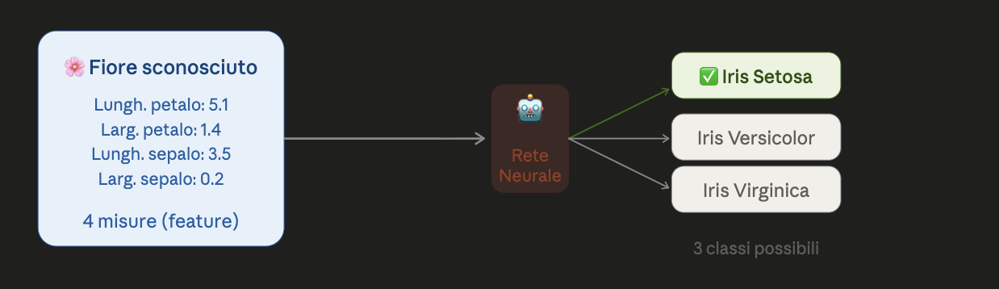
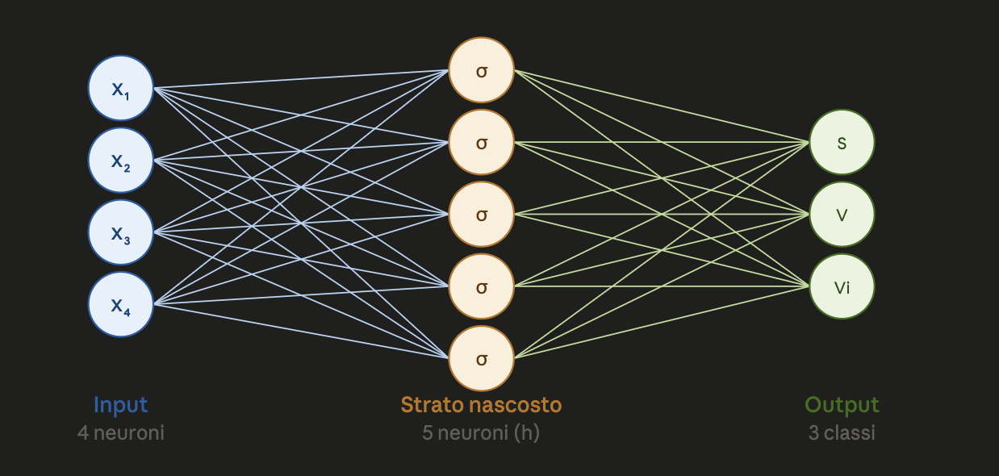
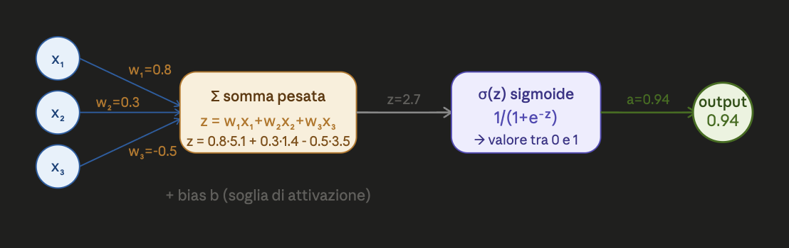
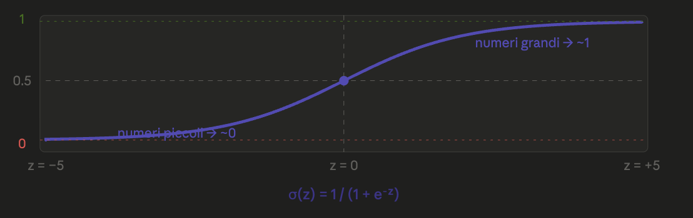
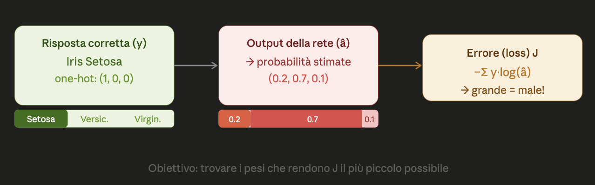
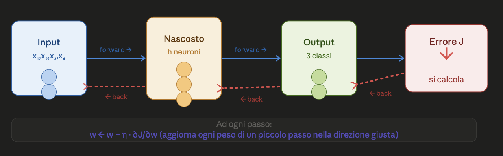

# 🧠 Reti Neurali — Spiegazione Completa

## 1. Il Problema

Immagina di avere 150 fiori e devi classificarli in 3 specie, guardando solo 4 misure (lunghezza/larghezza di petali e sepali). La rete neurale **impara da sola** a fare questa classificazione, guardando esempi già etichettati.



---

## 2. La Struttura della Rete

La rete ha **3 livelli**:



### Notazione formale

- **Input**: $\mathbf{x} = (x_1, \ldots, x_d) \in \mathbb{R}^d$
- **Strato nascosto**: $h$ neuroni, con attivazioni $\mathbf{a}^H = (a_1^H, \ldots, a_h^H) \in \mathbb{R}^h$
- **Output**: $t$ neuroni (uno per classe), con attivazioni $\mathbf{a}^{OUT} = (a_1^{OUT}, \ldots, a_t^{OUT}) \in \mathbb{R}^t$

---

## 3. Come Funziona un Singolo Neurone

Ogni neurone fa **2 cose**:

### Step 1 — Somma pesata degli input

$$z_k^H = \sum_{f=1}^{d} w_{f,k}^H \, x_f + b_k^H$$

Pensa ai pesi $w$ come a "quanto conta" ciascuna feature. Il bias $b$ è come una soglia regolabile.

### Step 2 — Funzione di attivazione (sigmoide)

$$a_k^H = \sigma(z_k^H) = \frac{1}{1 + e^{-z_k^H}}$$

La sigmoide **schiaccia** qualsiasi numero in un valore tra 0 e 1.




## 4. La Funzione Sigmoide

$$\sigma(z) = \frac{1}{1 + e^{-z}}$$



> **Perché è importante?** Introduce la **non-linearità** che permette alla rete di imparare pattern complessi, non solo rette.

Una proprietà utile della sigmoide (usata nella backprop):

$$\sigma'(z) = \sigma(z)\,(1 - \sigma(z))$$

---

## 5. Propagazione in Avanti (Forward Pass)

I calcoli fluiscono da sinistra a destra:

### Strato nascosto

$$\mathbf{z}^H = \mathbf{x} \, W^H + \mathbf{b}^H \in \mathbb{R}^{1 \times h}$$

$$\mathbf{a}^H = \sigma(\mathbf{z}^H)$$

dove $W^H \in \mathbb{R}^{d \times h}$ è la matrice dei pesi del layer nascosto.

*Costo computazionale:* $O(h \cdot d)$

### Strato di output

$$\mathbf{z}^{OUT} = \mathbf{a}^H \, W^{OUT} + \mathbf{b}^{OUT} \in \mathbb{R}^{1 \times t}$$

$$\mathbf{a}^{OUT} = \sigma(\mathbf{z}^{OUT})$$

dove $W^{OUT} \in \mathbb{R}^{h \times t}$.

*Costo computazionale:* $O(t \cdot h)$

### Previsione finale

$$\hat{y} = \underset{e=1}{\overset{t}{\arg\max}} \{ a_e^{OUT} \}$$

Si sceglie la classe con il valore più alto.

**Costo totale per un singolo campione:**

$$O(h \cdot d + t \cdot h)$$

che è uguale al numero totale di tutti i pesi $N$.

---

## 6. Addestramento — Come Impara la Rete?

### Codifica one-hot

Le etichette sono in formato **one-hot**: se il fiore è della classe 2 tra 3, l'etichetta è:

$$\mathbf{y} = (0,\ 1,\ 0)$$

In generale: $y_e \in \{0,1\}$ con $\sum_e y_e = 1$.

### Funzione di perdita (Loss Function)

Si misura l'errore con una **log loss** generalizzata al caso multiclasse:

$$\mathcal{J}(W^H, W^{OUT};\, \mathbf{x}, \mathbf{y}) = -\sum_{e=1}^{t} \left[ y_e \log a_e^{OUT} + (1 - y_e) \log(1 - a_e^{OUT}) \right]$$


### Perché non usare la forza bruta?

Calcolare ogni derivata numericamente costa:

$$O\!\left(n \cdot (hd + ht)^2 \cdot \text{epochs}\right)$$

Troppo lento! La soluzione è la **backpropagation**.

---

## 7. Algoritmo di Backpropagation

L'idea chiave: calcolare tutti i gradienti **in un solo passaggio**, propagando l'errore all'indietro strato per strato.


### Step 1 — Errore sullo strato di output

Moltiplicando la derivata della loss per la derivata della sigmoide si ottiene una formula elegante:

$$\delta_e^{OUT} = a_e^{OUT} - y_e$$

Semplicissimo: **differenza tra ciò che la rete ha prodotto e la risposta corretta**.

In forma matriciale (su tutti gli $n$ campioni):

$$\boldsymbol{\delta}^{OUT} = A^{OUT} - Y \in \mathbb{R}^{n \times t}$$

### Step 2 — Errore sullo strato nascosto

L'errore del layer nascosto si ottiene "rimandando indietro" l'errore dell'output:

$$\delta_k^H = a_k^H (1 - a_k^H) \sum_{e=1}^{t} w_{k,e}^{OUT} \, \delta_e^{OUT}$$

In forma matriciale (con $\odot$ = prodotto elemento per elemento):

$$\boldsymbol{\delta}^H = A^H \odot (1 - A^H) \odot \left(\boldsymbol{\delta}^{OUT} \cdot (W^{OUT})^\top\right) \in \mathbb{R}^{n \times h}$$

### Step 3 — Calcolo dei gradienti

Per i pesi dello **strato di output**:

$$\frac{\partial \mathcal{J}}{\partial w_{k,e}^{OUT}} = \delta_e^{OUT} \cdot a_k^H$$

$$\frac{\partial \mathcal{J}}{\partial W^{OUT}} = (A^H)^\top \cdot \boldsymbol{\delta}^{OUT} \in \mathbb{R}^{h \times t}$$

Per i pesi dello **strato nascosto**:

$$\frac{\partial \mathcal{J}}{\partial w_{f,k}^H} = \delta_k^H \cdot x_f$$

$$\frac{\partial \mathcal{J}}{\partial W^H} = X^\top \cdot \boldsymbol{\delta}^H \in \mathbb{R}^{d \times h}$$

### Step 4 — Aggiornamento dei pesi (Gradient Descent)

$$W^H \leftarrow W^H - \eta \cdot \frac{\partial \mathcal{J}}{\partial W^H}$$

$$W^{OUT} \leftarrow W^{OUT} - \eta \cdot \frac{\partial \mathcal{J}}{\partial W^{OUT}}$$

dove $\eta$ è il **learning rate** (tasso di apprendimento).

```
  η troppo grande → salta oltre il minimo, non converge
  η troppo piccolo → converge lentamente, ci vuole un'eternità
  η giusto → scende regolarmente verso il minimo di J ✓
```

---

## 8. Forma Vettoriale — Tabella Riassuntiva

| Operazione | Formula | Codice Python |
|---|---|---|
| Forward nascosto | $A^H = \sigma(X W^H + \mathbf{b}^H)$ | `a_h = sigmoid(X @ w_h + b_h)` |
| Forward output | $A^{OUT} = \sigma(A^H W^{OUT} + \mathbf{b}^{OUT})$ | `a_out = sigmoid(a_h @ w_out + b_out)` |
| Errore output | $\boldsymbol{\delta}^{OUT} = A^{OUT} - Y$ | `delta_out = a_out - y_enc` |
| Errore nascosto | $\boldsymbol{\delta}^H = A^H \odot (1-A^H) \odot (\boldsymbol{\delta}^{OUT}(W^{OUT})^\top)$ | `delta_h = (delta_out @ w_out.T) * a_h*(1-a_h)` |
| Gradiente $W^H$ | $X^\top \boldsymbol{\delta}^H$ | `grad_w_h = X.T @ delta_h` |
| Gradiente $W^{OUT}$ | $(A^H)^\top \boldsymbol{\delta}^{OUT}$ | `grad_w_out = a_h.T @ delta_out` |
| Update $W^H$ | $W^H \leftarrow W^H - \eta \nabla W^H$ | `w_h -= eta * grad_w_h` |
| Update $W^{OUT}$ | $W^{OUT} \leftarrow W^{OUT} - \eta \nabla W^{OUT}$ | `w_out -= eta * grad_w_out` |

---

## 9. Complessità Computazionale

| Metodo | Costo per epoca |
|---|---|
| Forza bruta (derivate numeriche) | $O\!\left(n \cdot (hd+ht)^2 \cdot \text{epochs}\right)$ |
| **Backpropagation** | $O\!\left(n \cdot h \cdot (d + t)\right)$ |

La backpropagation è **un ordine di grandezza più efficiente**.

---

## 10. Implementazione Python — Classe `NeuralNetMLP`

### Parametri principali

| Parametro | Significato |
|---|---|
| `n_hidden` | Numero di neuroni nello strato nascosto |
| `l2` | Regolarizzazione L2 (penalizza pesi grandi → evita overfitting) |
| `epochs` | Numero di passaggi sull'intero dataset |
| `eta` | Learning rate $\eta$ |
| `minibatch_size` | Dimensione dei mini-batch |
| `shuffle` | Mescola i dati ogni epoca |

### Struttura del codice

```python
class NeuralNetMLP:
    def __init__(self, n_hidden=30, l2=0., epochs=100,
                 eta=0.001, shuffle=True, minibatch_size=1, seed=None):
        ...

    def _sigmoid(self, z):
        return 1. / (1. + np.exp(-np.clip(z, -250, 250)))

    def _forward(self, X):
        z_h   = np.dot(X, self.w_h) + self.b_h
        a_h   = self._sigmoid(z_h)
        z_out = np.dot(a_h, self.w_out) + self.b_out
        a_out = self._sigmoid(z_out)
        return z_h, a_h, z_out, a_out

    def fit(self, X_train, y_train, X_valid, y_valid):
        # Inizializzazione pesi casuali vicino a 0
        self.w_h   = random.normal(0, 0.1, size=(n_features, n_hidden))
        self.w_out = random.normal(0, 0.1, size=(n_hidden, n_output))

        for epoch in range(self.epochs):
            for batch in minibatches:
                # FORWARD
                z_h, a_h, z_out, a_out = self._forward(X_batch)

                # BACKWARD
                delta_out = a_out - y_batch                      # errore output
                delta_h   = (delta_out @ w_out.T) * a_h*(1-a_h) # errore nascosto

                # GRADIENTI
                grad_w_out = a_h.T   @ delta_out
                grad_w_h   = X.T     @ delta_h

                # UPDATE (con regolarizzazione L2)
                w_out -= eta * (grad_w_out + l2 * w_out)
                w_h   -= eta * (grad_w_h   + l2 * w_h)
```

### Mini-batch training

Invece di usare tutto il dataset ogni volta, si usano **piccoli gruppi** (mini-batch):

```
Dataset completo (n=150)
├── Batch 1: campioni [0..49]   → forward + backward + update
├── Batch 2: campioni [50..99]  → forward + backward + update
└── Batch 3: campioni [100..149] → forward + backward + update
                                          ↑
                              1 epoca = tutti i batch
```

Vantaggi: più veloce, aggiornamenti più frequenti, minor memoria.

---

## 11. Applicazione — Dataset Iris

```python
nn = NeuralNetMLP(
    n_hidden=50,        # 50 neuroni nascosti
    l2=0.01,            # regolarizzazione leggera
    epochs=200,         # 200 passaggi
    eta=0.0025,         # learning rate
    minibatch_size=50,
    shuffle=True,
    seed=1
)

nn.fit(X_train, y_train, X_valid=X_test, y_valid=y_test)
# 70% dati per training, 30% per validazione
```

---

## 12. Schema Riassuntivo Completo

```
╔══════════════════════════════════════════════════════════════╗
║                    CICLO DI ADDESTRAMENTO                    ║
╠══════════════════════════════════════════════════════════════╣
║                                                              ║
║  Per ogni epoca:                                             ║
║    Per ogni mini-batch:                                      ║
║                                                              ║
║    1. FORWARD PASS                                           ║
║       x → [W_H, b_H] → z_H → σ → a_H                       ║
║                              → [W_OUT, b_OUT] → z_OUT → σ → a_OUT
║                                                              ║
║    2. CALCOLA ERRORE                                         ║
║       J = -Σ [y·log(a) + (1-y)·log(1-a)]                    ║
║                                                              ║
║    3. BACKWARD PASS                                          ║
║       δ_OUT = a_OUT - y                                      ║
║       δ_H   = a_H(1-a_H) ⊙ (δ_OUT · W_OUT^T)               ║
║                                                              ║
║    4. AGGIORNA PESI                                          ║
║       W_OUT ← W_OUT - η · (A_H^T · δ_OUT)                   ║
║       W_H   ← W_H   - η · (X^T   · δ_H)                    ║
║                                                              ║
╚══════════════════════════════════════════════════════════════╝
```

---

## Glossario Rapido

| Termine | Significato intuitivo |
|---|---|
| **Peso** $w$ | "Quanto conta" una connessione tra neuroni |
| **Bias** $b$ | Soglia di attivazione del neurone |
| **Sigmoide** $\sigma$ | Funzione che schiaccia tutto tra 0 e 1 |
| **Forward pass** | Calcolo dalla sinistra verso destra (previsione) |
| **Loss** $\mathcal{J}$ | Misura di quanto la rete sta sbagliando |
| **Gradiente** $\nabla$ | "Direzione in salita" della loss → ci muoviamo al contrario |
| **Backprop** | Algoritmo efficiente per calcolare tutti i gradienti |
| **Learning rate** $\eta$ | Quanto spostiamo i pesi a ogni passo |
| **Epoca** | Un passaggio completo su tutto il dataset |
| **Mini-batch** | Piccolo gruppo di campioni usato per un singolo aggiornamento |
| **One-hot** | Codifica etichette: es. classe 2 di 3 → $(0, 1, 0)$ |
| **Regolarizzazione L2** | Penalità sui pesi grandi per evitare overfitting |

---

