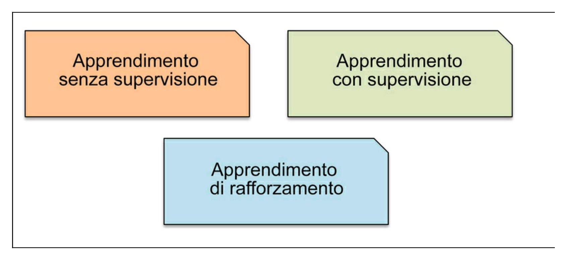
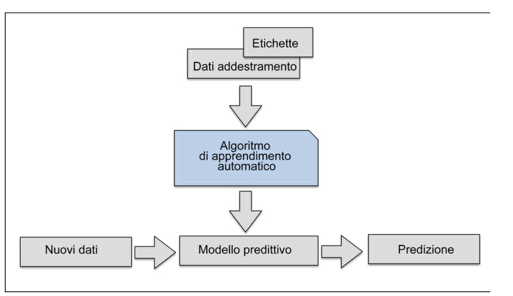
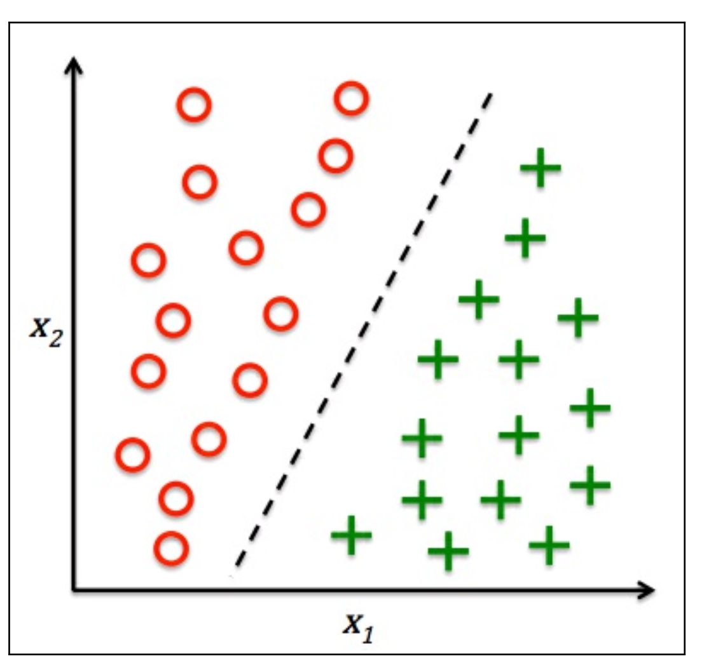
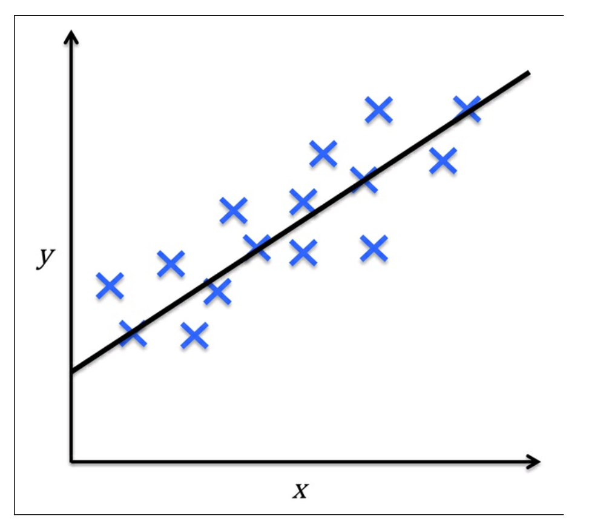
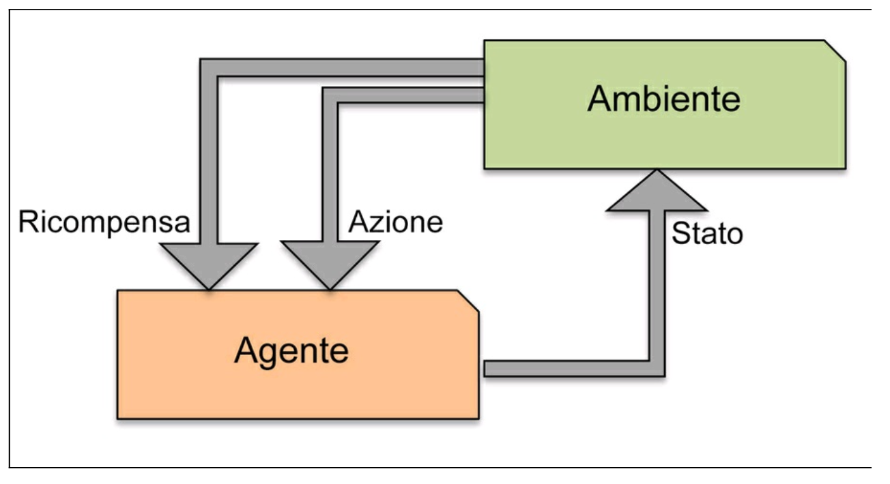
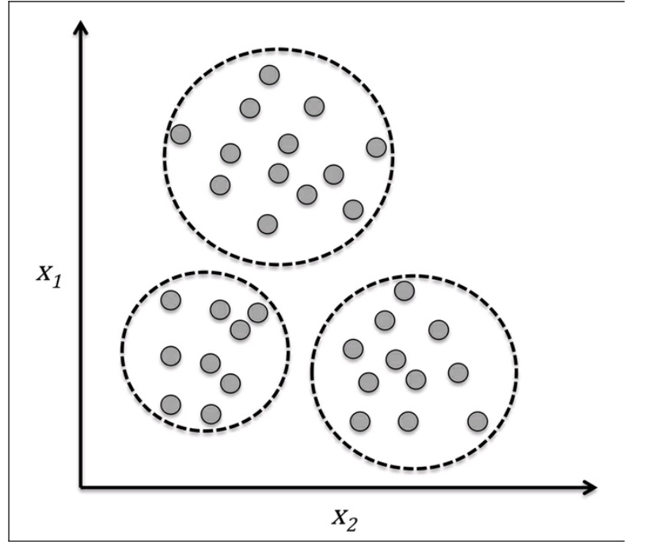
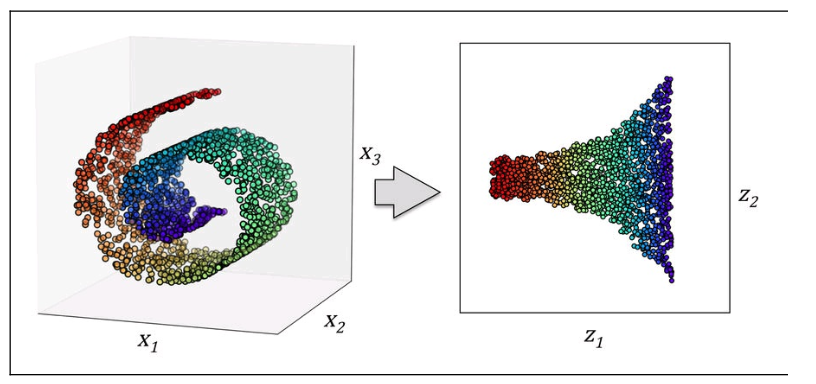
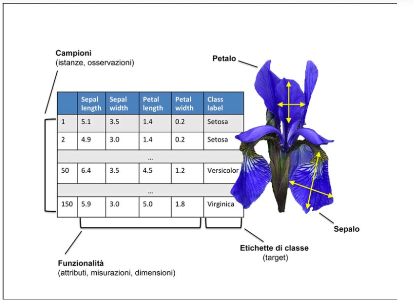
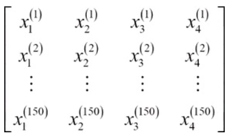
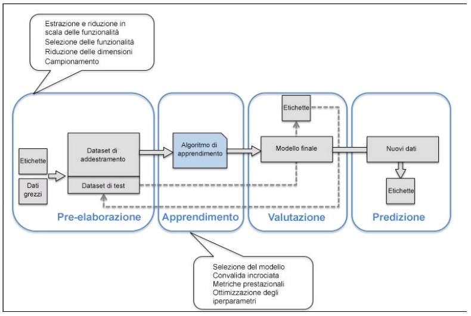

#DataMining

## I tre diversi tipi di machine learning
Esistono tre diversi tipi di machine learning: **apprendimento con supevisione**, **apprendimento senza supervisione** e **apprendimento di rafforzamento** 

### Effettuare previsioni sul futuro grazie all'apprendimento con supervisione
Lo scopo principale dell'apprendimento con supervisione consiste nel trarre un modello a partire da dati di **addestramento** etichettati, i quali ci consentono di effettuare previsioni relative a dati non disponibili o foturi. Il termine **con supervisione** fa riferimento al fatto che nell'insieme di campioni i segnali di output desiderati (le etichette) sono già noti

Considerando l'esempio del filtraggio dei messaggi spam di posta elettronica, possiamo addestrare un modello applicando un algoritmo di apprendimento con supervisione a un insieme di messaggi di posta elettronica **già etichettati**, che siano stati correttamente contrassegnati come spam oppure non-spam, per fargli determinare se un nuovo messaggio di posta elettronica appartiene all'una o all'altra categoria. 

#### Classificazione per la predizione delle etichette delle classi
La classificazione è una sottocategoria dell'apprendimento con supervisione, dove l'obiettivo è quello di **prevedere le etichette di categoria delle classi per le nuove istanze**, sulla base delle osservazioni compiute nel passato. Queste etichette sono valori discreti, non ordinati, che possono essere considerati come **appartenenti a un gruppo delle istanze**. Un esempio di un compito di **classificazione multiclasse** è il riconoscimento del testo scritto a mano. Qui possiamo raccogliere un dataset di apprendimento che è costituito da più esempi di scrittura a mano di ciascuna lettera dell'alfabeto. Ora, se un utente fornisce un nuovo carattere scritto a mano tramite un dispositivo di input, il nostro modello predittivo sarà in grado di prevedere con una certa precisione la lettera corretta dell'alfabeto.

Questa figura illustra il concetto del **compito di classificazione binaria sulla base di campioni di apprendimento**: quindici di essi sono etichettati come *classe negativa* (i cerchi) e altrettanti campioni sono etichettati come *classe positiva* (i segni +). In questa situazione, il nostro dataset è bidimensionale, il che significa che a ogni campione possono essere associati due colori: $X_{1}$ e $X_{2}$. Ora, possiamo utilizzare un algoritmo di apprendimento con supervisione per trarre una regola che sia in grado di separare queste due classi e classificare i nuovi dati in ognuna di queste due categoria sulla base dei loro valori $X_{1}$ e $X_{2}$

#### Regressione per la previsione di risultati continui 
Un secondo tipo di apprendimento con supervisione è la previsione di risultati continui, chiamata anche **analisi di regressione**. Nell'analisi di regressione, abbiamo un certo numero di variabili predittive (descrittive) e una variabile target continua (risultato). 
Supponiamo di essere interessati a prevedere le valutazioni di una prova scritta dei nostri studenti. Se vi è una relazione fra il tempo dedicato a studiare per il test e i risultati finali, potremmo utilizzare questi tempi come **dati di apprendimento** per derivare un modello che utilizzi proprio come il tempo dedicato allo studio per prevedere le valutazioni dei futuri studenti che pensano di svolgere questo test. 

Questa figura illustra il concetto di **regressione lineare**. Data una variabile predittiva $x$ e una variabile risposta $y$, tracciamo una linea retta attraverso questi dati in modo da minimizzare la distanza (si parla infatti di distanza quadratica media) fra i punti del campione e la linea. Ora possiamo utilizzare il punto di intersezione e la pendenza che abbiamo appreso da questi dati per prevedere la variabile target per nuovi dati. 

### Risolvere problemi interattivi con l'apprendimento di rafforzamento
Un altro tipo di apprendimento automatico è **l'apprendimento di rafforzamento**. Qui l'obiettivo è quello di **sviluppare un sistema che migliori le proprie prestazioni sulla base delle interazioni con l'ambiente**. 
Poichè, tipicamente, le informazioni relative allo stato corrente includono anche un cosiddetto segnale di **ricompensa** (reward), possiamo considerare l'apprendimento di rafforzamento come un esempio di apprendimento con supervisione. 
Tuttavia, nell'apprendimento di raforzamento, questo feedback non è l'etichetta o il valore corretto di verità, ma una **misura della qualità con cui l'azione è stata misurata da una funzione di ricompensa**.
Tramite l'interazione con l'ambiente, un agente può quindi utilizzare l'apprendimento di rafforzamento per imparare una serie di azioni che massimizzano questa ricompensa tramite un approccio esplorativo del tipo **trial-and-error** o una pianificazione deliberativa.  
Un esempio classico di apprendimento di rafforzamento è il motore del gioco degli scacchi, qui l'agente decide come svolgere una serie di mosse a seconda dello stato della scacchiera (l'ambiente) e la ricompensa può essere definita come la vittoria o la sconfitta alla fine del gioco

### Scoprire le strutture nascoste con l'apprendimento senza supervisione
Nell'apprendimento con supervisione, conosciamo in anticipo la **risposta corretta** quando descriviamo il nostro modello, mentre nell'apprendimento di rafforzamento **definiamo una misura, o ricompensa**, per le specifiche azioni messe in atto dall'agente. 
Nell'apprendimento senza supervisione, al contrario, abbiamo a che fare con **dati non etichettati o dati dalla struttura ignota**. Utilizzando tecniche di apprendimento senza supervisione, siamo in grado di osservare la struttura dei nostri dati, per estrarre da essi informazioni cariche di significato senza però contare sulla guida nè di una variabile nota relativa al risultato, nè una funzione di ricompensa.

#### Ricerca di sottogruppi tramite il clustering
Il **clustering** è una tecnica esplorativa di analisi dei dati che ci consente di **organizzare una serie di informazioni all'interno di gruppi significativi** (i cluster) senza avere alcuna precedente conoscenza delle appartenenze a tali gruppi. Ogni cluster che può essere derivato durante l'analisi definisce un gruppo di oggetti che condividono un certo grado di similarità, ma che sono più dissimili rispetto agli oggetti presenti negli altri cluster, motivo per cui il clustering viene talvolta chiamato "classificazione senza supervisione". 

Questa figura illustra il modo in cui il clustering può essere applicato all'organizzazione di alcuni dati senza etichetta suddividendoli in tre gruppi distinti sulla base della similarità delle caratteristiche $X_{1}$ e $X_{2}$

#### Riduzione dimensionale per la compressione dei dati
Un altro sottocampo dell'apprendimento senza supervisione è la **riduzione dimensionale**. Spesso ci troviamo a operare con dati a elevata dimensionalità (ogni osservazione fornisce un elevato numero di misure) il che può rappresentare una sfida in termini di spazio di memorizzazione disponibile e prestazioni computazionali degli algoritmi di apprendimento automatico. 
La riduzione dimensionale senza supervisione è un approccio comunemente utilizzato nella pre-elaborazione delle caratteristiche, e ha lo scopo di **eliminare dai dati il "rumore"**, che può anche introdurre un **degrado delle prestazioni predittive di alcuni algoritmi**, e di comprimere i dati in un sottospazio dimensionale più compatto, mantenendo però la maggior parte delle informazioni rilevanti.
Talvolta la riduzione dimensionale può essere utile anche per **rappresentare i dati**.

Questa figura mostra un esempio in cui la riduzione della dimensionalità non lineare è stata applicata in modo da comprimere un grafico 3D Swiss Roll in un nuovo sottospazio bidimensionale delle caratteristiche 

## Introduzione alla terminologia e alla notazione di base
Ora che abbiamo introdotto le tre grandi categorie dell'apprendimento automatico, diamo un'occhiata alla terminologia di base che ci troveremo a utilizzare nel corso dei prossimi capitoli. La seguente tabella rappresenta un **estratto del dataset Iris**, che è un classico esempio nel campo dell'apprendimento automatico. Il dataset Iris contiene la misurazione di centocinquanta specie di fiori iris di tre diverse specie: *Setosa, Versicolor e Virginica*. Qui, ogni campione di fiore rappresenta una riga del dataset e la misurazione del fiore in centimetri viene indicata in colonne, che rappresentano le caratteristiche del dataset.

Utilizzeremo una notazione a **matrici e vettori** per far riferimento ai dati. Seguiremo la convenzione comune di rappresentare ciascun campione come una riga distinta nella matrice delle caratteristiche, $X$, dove ciascuna caratteristica è conservata come una colonna distinta.
Il dataset Iris, costituito da centocinquanta campioni e quattro caratteristiche, può pertanto essere scritto come una matrice 150 x 4 $X \in \mathbb{R}^{150 \text{x} 4}$ 

Utilizzeremo il numero in apice (i) per fare riferimento all'i-esimo campione di addestramento e il numero in pedice (j) per far riferimento alla j-esima dimensione del dataset di apprendimento

Utilizzeremo lettere minuscole in grassetto per far riferimento ai vettori ($x \in \mathbb{R}^{n \text{x} 1}$) e lettere maiuscole in grassetto per far riferimento alle matrici ($X \in \mathbb{R}^{n \text{x} m}$). 

Per esempio, $X_{1}^{150}$ fa riferimento alla prima dimensione del centocinquantesimo campione di fiori, la **larghezza del sepalo**. Pertanto, ciascuna riga di questa matrice delle caratteristiche rappresenta l'istanza di un fiore e può essere scritta come un vettore a riga a 4 dimensioni $x^{(i)} \in \mathbb{R}^{1 \text{x} 4}$,

$$x^{(i)} = [x_{1}^{(i)} x_{2}^{(i)} x_{3}^{(i)} x_{4}^{(i)}]$$

Ogni dimensione relativa a una caratteristica è invece un vettore a colonna a 150 dimensioni $x^{(i)} \in \mathbb{R}^{150 \text{x} 1}$, per esempio

$$x_{j} 
\begin{bmatrix}
x_{j}^{1} \\
x_{j}^{2} \\
x_{j}^{150}
\end{bmatrix}$$

### Una roadmap per la realizzazione di sistemi di approccio automatico
In questo paragrafo ci concentreremo su altri elementi importanti di un sistema di apprendimento automatico che contraddistinguono l'algoritmo di apprendimento. 

Questa figura rappresenta un **tipico diagramma di flusso** per l'impiego dell'apprendimento automatico nella **modellazione predittiva**

