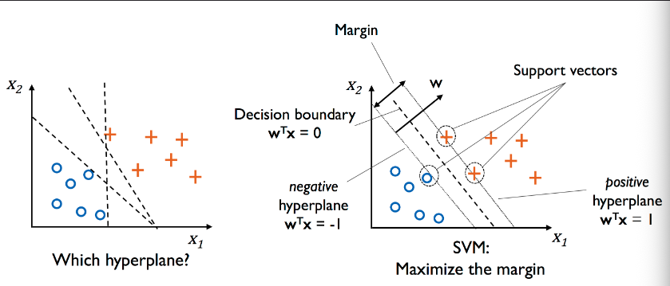
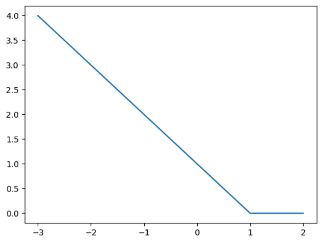
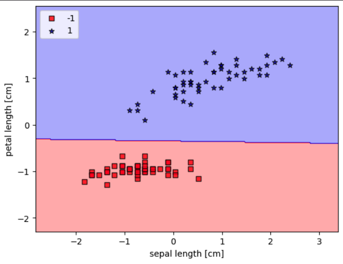
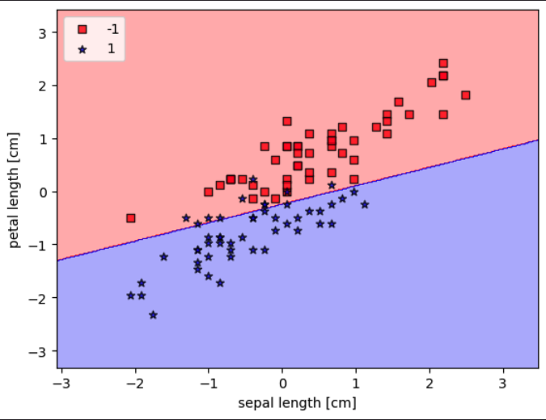
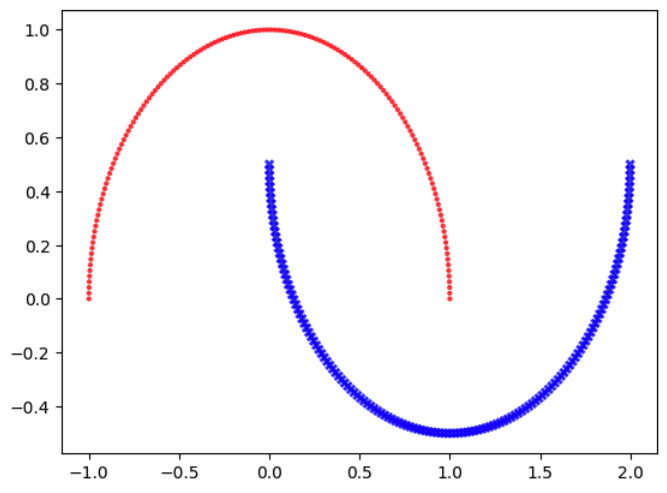
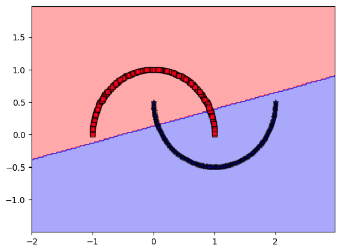
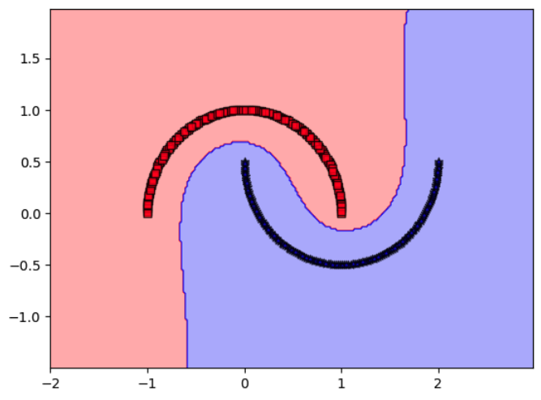

#DataMining 



Nel contesto della classificazione binaria, si assuma per il momento che le due classi con etichette -1 e +1, siano **separabili linearmente dall'iperpiano**
$$H : w \cdot x + w_{0} = 0$$
Per alcuni esempi della classe +1 si avrà
$$H^{+} : w \cdot x^{+} + w_{0} = +1$$
e per alcuni della classe -1,
$$H^{-} : w \cdot x^{-} + w_{0} = -1$$
Gli esempi $x^{+}$ e $x^{-}$ sono detti **vettori di supporto**. Si vuole massimizzare la distanza tra gli iperpiani paralleli $H^{+}$ e $H^{-}$, ovvero **massimizzare il margine** in modo da abbassare **l'errore di generalizzazione**

La distanza tra $H^{+}$ e $G^{-}$ la possiamo vedere come la distanza di $x^{+}$ da $H$ più la distanza di $x^{-}$ da $H$ 
$$d = \frac{w \cdot x^{+}}{||w||} - \frac{w \cdot x^{-}}{||w||}$$
Ricordiamo che la distanza $(w \cdot x) / ||w||$ è con segno, ovvero negativa, se il punto è nell'iperspazio negativo. Usando le considerazioni su $H^{+}$ e $H^{-}$
$$d = \frac{1 - w_{0}}{||w||} - \frac{-1-w_{0}}{||w||} = \frac{2}{||w||}$$
Quindi l'obiettivo è massimizzare $2 / ||w||$. Poichè $||w||$ contiene una radice conviene ottimizzare il quadrato e passare al reciproco, minimizzandolo. Quindi la funzione obiettivo diventa
$$\frac{1}{2}||w||^{2}$$
con i vincoli che gli esempi siano classificati correttamente ovvero, per ogni esempio $x^{(i)}$ con $i = 1, ..., n,$
$$y_{i}(w \cdot x^{(i)}+w_{0}) \geq 1$$

## Casi non separabili linearmente
In questi casi i vincoli precedenti non possono essere soddisfatti e il problema non ammette soluzioni. Per risolvere questi casi si 'ammorbidiscono' i vincoli introducendo $n$ variabili positive dette **slack** nel seguente modo
$$w \cdot x^{(i)} + w_{0} \geq 1 - \xi^{(i)} \quad \text{se $y^{(i)} = 1$}$$
$$w \cdot x^{(i)} + w_{0} \leq -1 + \xi^{(i)} \quad \text{se $y^{(i)} = -1$}$$
$$\xi^{(i)} \geq 0$$
Più le $\xi$ sono vicine a 0 e più il vincolo è forte, più sono grandi (ricorda che sono $\geq$ 0) più il margine è ammorbidito. Quindi la funzione obiettivo diventa
$$\frac{1}{2}||w||^{2} + C\sum\limits^{n}_{i=1} \xi^{(i)}$$
Dove $C$ è un iperparametro che possiamo usare per controllare quanto penalizzare le classificazioni errate. Con valori grandi si penalizzano maggiormente.

Questo problema può essere risolto con tecniche di programmazione quadratica ma anche con discesa del gradiente ma allo scopo dobbiamo eliminare i vincoli

## Hinge Loss
L'eliminazione dei vincoli nella precedente formulazione passa attraverso la sostituzione delle variabili $\xi^{(i)}$ con delle funzioni 'cerniera' che valgono 0 in caso di classificazione corretta e **crescono linearmente man mano che aumenta l'errore**
$$\xi^{(i)} = max(0, 1 - y^{(i)}(w \cdot x^{(i)}+w_{0} ))$$
Nel caso di classificazione corretta $y^{(i)}(w \cdot x^{(i)}+w_{0}) \geq 1$ quindi $\xi^{(i)}$ vale 0, altrimenti diventa via via più grande man mano che $y^{(i)}(w \cdot x^{(i)}+w_{0})$ si allontana da 1 verso sinistra. Nell'immagine un plot di una ipotetica funzione hinge

```python
import numpy as np
import matplotlib.pyplot as plt

def xi(z):
    return max(0, 1-z)

z_val = np.arange(-3, 3, 1)
plt.plot(z_val, [xi(z) for z in z_val])
```



Pertanto la funzione obiettivo diventa
$$J(w) = \frac{1}{2}||w||^{2} + C \sum^{n}_{i=1} max(0, 1 - y^{(i)}(w\cdot x^{(i )} + w_{0}))$$
Si osservi che ora i vincoli non sono più necessari in quanto sostituendo alle $\xi^{(i)}$ le funzioni hinge questi risultano sempre soddisfatti

## Discesa del gradiente

Partiamo con il calcolare le derivate parziali di $J(w)$.
$$\frac{d}{d w_j} J(w) = w_j + C \frac{d}{d w_j} \sum_{i=1}^n \max\left(0, 1 - y^{(i)}(w\cdot x^{(i)} + w_0) \right)$$
La derivata della sommatoria non può essere generalizzata perché dipende dal segno di
$$1-y^{(i)}( w\cdot x^{(i)} + w_0 ).$$
Se $1-y^{(i)}( w\cdot x^{(i)} + w_0 ) < 0$ (esempio classificato correttamente)
$$\frac{d}{d w_j} \max\left(0, 1 - y^{(i)}(w\cdot x^{(i)} + w_0) \right) = 0.$$
Se $1-y^{(i)}( w\cdot x^{(i)} + w_0 ) \geq 0$
$$\frac{d}{d w_j} \max\left(0, 1 - y^{(i)}(w\cdot x^{(i)} + w_0) \right) = -y^{(i)}x_j^{(i)}.$$
Questo ci fornisce un metodo su come aggiornare il pesi $w$: usando un approccio stocastico, per ogni nuovo esempio $x^{(i)}$
$$w  \leftarrow \left\{ \begin{array}{lcl} w - \eta w & & \text{se $y^{(i)}( w\cdot x^{(i)} + w_0 ) > 1$}\\ w - \eta \left(w  - C y^{(i)} x^{(i)} \right) & & \text{altrimenti}
\end{array}
\right.$$

``` python
import os
import numpy as np
import pandas as pd


import matplotlib.pyplot as plt
from matplotlib.colors import ListedColormap

from time import time


def plot_decision_regions(X, y, classifier, resolution=0.02):

    # setup marker generator and color map
    markers = ('s', '*', 'o', '^', 'v', '*')
    colors = ('red', 'blue', 'lightgreen', 'gray', 'cyan')
    cmap = ListedColormap(colors[:len(np.unique(y))])

    # plot the decision surface
    x1_min, x1_max = X[:, 0].min() - 1, X[:, 0].max() + 1
    x2_min, x2_max = X[:, 1].min() - 1, X[:, 1].max() + 1
    xx1, xx2 = np.meshgrid(np.arange(x1_min, x1_max, resolution),
                           np.arange(x2_min, x2_max, resolution))
    Z = classifier.predict(np.array([xx1.ravel(), xx2.ravel()]).T)
    Z = Z.reshape(xx1.shape)
    plt.contourf(xx1, xx2, Z, alpha=0.3, cmap=cmap)
    plt.xlim(xx1.min(), xx1.max())
    plt.ylim(xx2.min(), xx2.max())

    # plot class examples
    for idx, cl in enumerate(np.unique(y)):
        plt.scatter(x=X[y == cl, 0], 
                    y=X[y == cl, 1],
                    alpha=0.8, 
                    c=colors[idx],
                    marker=markers[idx], 
                    label=cl, 
                    edgecolor='black')

```


``` python
class SVM(object):
    """Support Vector Machine (SVM) classifier using gradient descent."""

    
    def __init__(self, eta=0.01, n_iter=1000, C=1.0, random_state=1, tol=1e-4, verbose=True):
        self.eta = eta  # Learning rate
        self.n_iter = n_iter  # Number of iterations
        self.C = C  # Regularization parameter
        self.random_state = random_state
        self.tol = tol  # Tolerance for early stopping
        self.verbose = verbose  # Print iterations
    
    def fit(self, X, y):
        rgen = np.random.RandomState(self.random_state)
        self.w_ = rgen.normal(loc=0.0, scale=0.01, size=1 + X.shape[1])
        self.last_cost = None
        
        for count in range(self.n_iter):
            cost = 0
            for xi, yi in zip(X, y):
                margin = yi * (np.dot(xi, self.w_[1:]) + self.w_[0])
                
                if margin >= 1:
                    self.w_ -= self.eta * self.w_ 
                else:
                    self.w_[1:] -= self.eta * (self.w_[1:] - self.C * yi * xi)  
                    self.w_[0] -= self.eta * (-self.C * yi)
                
                cost += max(0, 1 - margin)  
            
            if self.last_cost is not None and abs(cost - self.last_cost) < self.tol:
                if self.verbose:
                    print(f'Uscita anticipata dopo {count} iterazioni')
                break
            self.last_cost = cost
        
        return self
    
    def predict(self, X):
        return np.where(np.dot(X, self.w_[1:]) + self.w_[0] >= 0, 1, -1)

```

``` python
s = os.path.join('dataset', '01-02-iris.csv')
df = pd.read_csv(s,
                 header=None,
                 encoding='utf-8')

```


## Esempi
#### Separabile

``` python
# [0:50] iris-setosa
# [50:100] iris-versicolor
# [100:150] iris-virginica
y = df.iloc[:100, 4].values
y = np.where(y == 'Iris-versicolor', 1, -1)

# extract sepal length and petal length
X = df.iloc[:100, [0, 2]].values

X_std = (X-X.mean(0))/X.std(0)
```

``` python
start_time = time()
svm = SVM(eta=0.001, C=1000, n_iter=1000, tol=0.01).fit(X_std, y)
end_time = time()
accuracy = np.mean(svm.predict(X_std) == y)
print('Accuratezza:', accuracy, '\n\tSecondi:', end_time-start_time)

plot_decision_regions(X_std, y, classifier=svm)

plt.xlabel('sepal length [cm]')
plt.ylabel('petal length [cm]')
plt.legend(loc='upper left')
```



#### Non separabile

``` python
# [0:50] iris-setosa
# [50:100] iris-versicolor
# [100:150] iris-virginica
y = df.iloc[50:, 4].values
y = np.where(y == 'Iris-versicolor', 1, -1)

# extract sepal length and petal length
X = df.iloc[50:, [0, 2]].values

X_std = (X-X.mean(0))/X.std(0)
```

``` python
start_time = time()
svm = SVM(eta=0.001, C=100, n_iter=1000, tol=0.01).fit(X_std, y)
end_time = time()
accuracy = np.mean(svm.predict(X_std) == y)
print('Accuratezza:', accuracy, '\n\tSecondi:', end_time-start_time)

plot_decision_regions(X_std, y, classifier=svm)

plt.xlabel('sepal length [cm]')
plt.ylabel('petal length [cm]')
plt.legend(loc='upper left')
```




#### Testare altri valori dell'iperparametro C

``` python
from sklearn.datasets import make_moons

X, y = make_moons(n_samples=300, noise=0.0, random_state=42)

markers=['.', 'X']
colors = ['r', 'b']

for idx, cl in enumerate(np.unique(y)):
        plt.scatter(x=X[y == cl, 0], 
                    y=X[y == cl, 1],
                    alpha=0.8, 
                    c=colors[idx],
                    marker=markers[idx], 
                    label=cl, 
                    edgecolor='none')
```




``` python
from sklearn.model_selection import train_test_split

X_train, X_test, y_train, y_test = train_test_split(
    X, y, test_size=0.3, random_state=1
)
```

``` python
from sklearn.svm import SVC

linear_svm = SVC(kernel='linear')
linear_svm.fit(X_train, y_train)

y_pred_linear = linear_svm.predict(X_test)
print("Accuracy SVM lineare:", np.mean(y_test == y_pred_linear))
```

``` python
plot_decision_regions(X, y, linear_svm)
```



``` python
rbf_svm = SVC(kernel='rbf', gamma=1)
rbf_svm.fit(X_train, y_train)

y_pred_rbf = rbf_svm.predict(X_test)
print("Accuracy SVM RBF:", np.mean(y_test == y_pred_rbf))
```

``` python
plot_decision_regions(X, y, rbf_svm)
```




