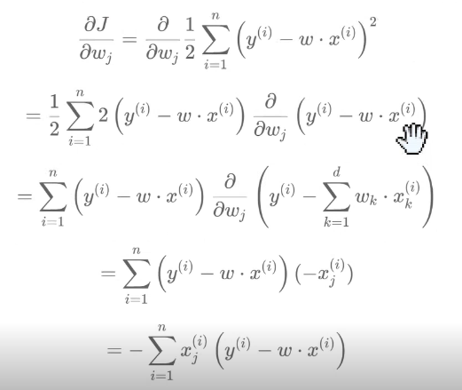

#DataMining 

## Regressione lineare

>[!example] **Esempio**
>Stima empirica del tempo di percorrenze di un itinerario escursionistico a partire dalla lunghezza $L$ e dal dislivello positivo $D$. La regola di Naismith afferma che bisogna prevedere un'ora per ogni miglio di percorrenze più un'ora ogni 2000 piedi di salita. Tradotto in km e metri
>
>$$t \approx \frac{L(km)}{5} + \frac{D(m)}{600}$$
>

Predirre il valore di una variabile su scala continua usando i valori delle caratteristiche. Nel caso la relazione sia lineare si cercano i coefficienti di un iperpiano

$$y = w_{0} + \sum^{d}_{i=1} w_{i} x_{i}$$
Dove il vettore $x = (x_{1}, ..., x_{d})$ è definito nello spazio delle caratteristiche e $w = (w_{o}, ..., w_{d})$ sono i **coefficienti dell'iperpiano**. L'iperpiano deve approssimare nel miglior modo possibile i dati osservati

Assumendo che:
- $x_{0}$ sia sempre 1
- $w = (w_{0}, ..., w_{d})$ e $x = (1, x_{1}, ..., x_{d})$

 $$y = w_{0} + \sum^{d}_{i=1} w_{i} x_{i} = \sum_{i=0}^{d} w_{i} x_{i} = w \cdot x$$
dove $\cdot$ indica il prodotto scalare.

Utilizzando gli $n$ campioni di addestramento, le cui features sono codificate nella matrice $X \in R^{nxd}$, e i cui output nel vettore $t \in R^{n}$, vogliamo trovare $w^{*}$ che minimizzi l'errore $J(w)$. Questo può essere definito come **somma degli errori quadrati** (il fattore 2 serve per comodità quando si passa alle derivate)

$$J(w) = \frac{1}{2} \sum^{n}_{i=1} (y^{(i)} - w \cdot x^{(i)})^{2}$$

Nella precedente equazione, con la notazione $x^{(i)}$ e $y^{(i)}$ viene indicato il vettore delle features dell'esempio $i$ ed il suo output. Pertanto $x^{(i)} \in R^{d}$ mentre $y^{(i)} \in R$


## Discesa del gradiente
La formula chiusa per il calcolo dei coefficienti della regressione lineare $((X^{T} X)^{-1}X^{T} y)$ ha un costo computazionale elevato, sia di tempo che di memoria. Per questo si preferisce l'algoritmo di **discesa del gradiente** molto più efficiente e scalabile a dataset molto grandi.

Troviamo $w^{*}$ che minimizza $J(w)$ utilizzando l'algoritmo di discesa del gradiente. L'idea è aggiornare una soluzione corrente $w$ spostandoci in direzione opposta al gradiente (che indica la direzione di massima pendenza positiva). L'approccio funziona solo se la funzione è derivabile e convessa (in questo modo il minimo è unico).  Quindi
$$w \leftarrow w + \Delta w = w - \eta \Delta J(w)$$
dove $\Delta J(w)$ indica il vettore delle derivate parziali (gradiente di $J$). La costante $\eta$ è chiamata **tasso di apprendimento** e controlla di quanto ci si sposta in funzione del gradiente. Andiamo a calcolare il valore delle componenti di $\Delta J(w)$



Dove $x_{j}$ rappresenta la colonna $j$ di $X$ e $x^{(i)}$ indica la riga $i$. Quindi, la precedente può essere riscritta come al prodotto scalare del vettore colonna $j$ di $X$ per il vettore

$$errors = \begin{pmatrix} y^{(i)} - w \cdot x^{(1)} \\ ... \\ y^{(n)} - w \cdot x^{(n)} \end{pmatrix}$$
Quindi
$$\nabla J(w) = -X^{T}\quad  \text{x} \quad \text{errors}$$

Dove il precedente è un prodotto matrice-vettore

``` python

'''
Parametri: X, matrice di addestramento; y, vettore etichette; eta, tasso di apprendimento;
'''

for _ in range(max_num_interations):
	errors = (y - np.dot(X, w[1:]) + w[0])
	w[1:] += eta * X.T.dot(errors)
	w[0] += eta * errors.sum()
	cost = (errors ** 2).sum() / 2.0
	costs.append(cost)

```

L'aggiornamento di $w[0]$ si spiega con il valore pari a 1 relativo alla variabile fittizia il cui peso è il termine noto. Questo induce una colonna di 1 della matrice $X$ (una riga in $X^{T}$) 


## Valutazione dell'errore
Se $y_{i}$ sono i valori reali e $z_{i}$ quelli predetti, l'**errore medio assoluto** (MAE, mean absolute error) è dato da 

$$\frac{1}{n} \sum\limits^{n}_{i=1} |y_{i} + z_{i}|$$
