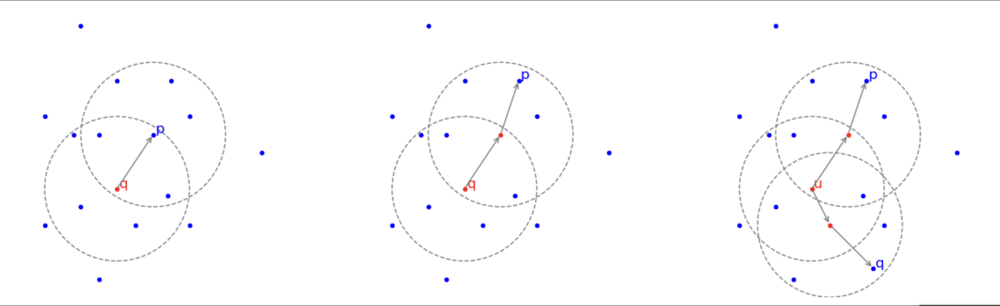
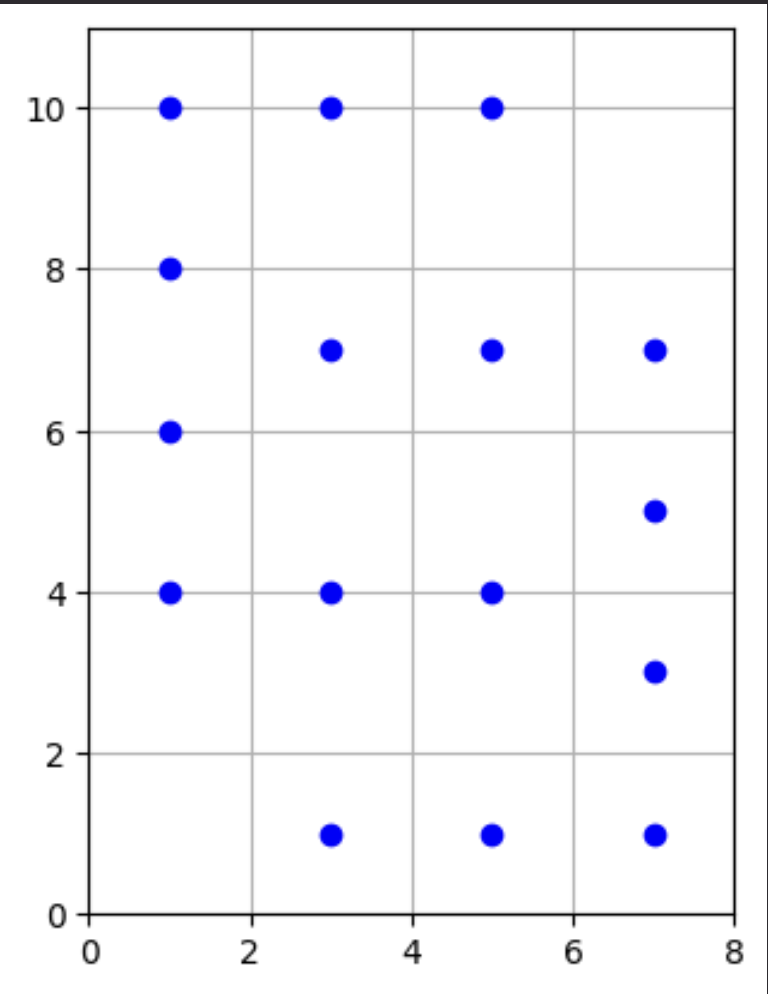
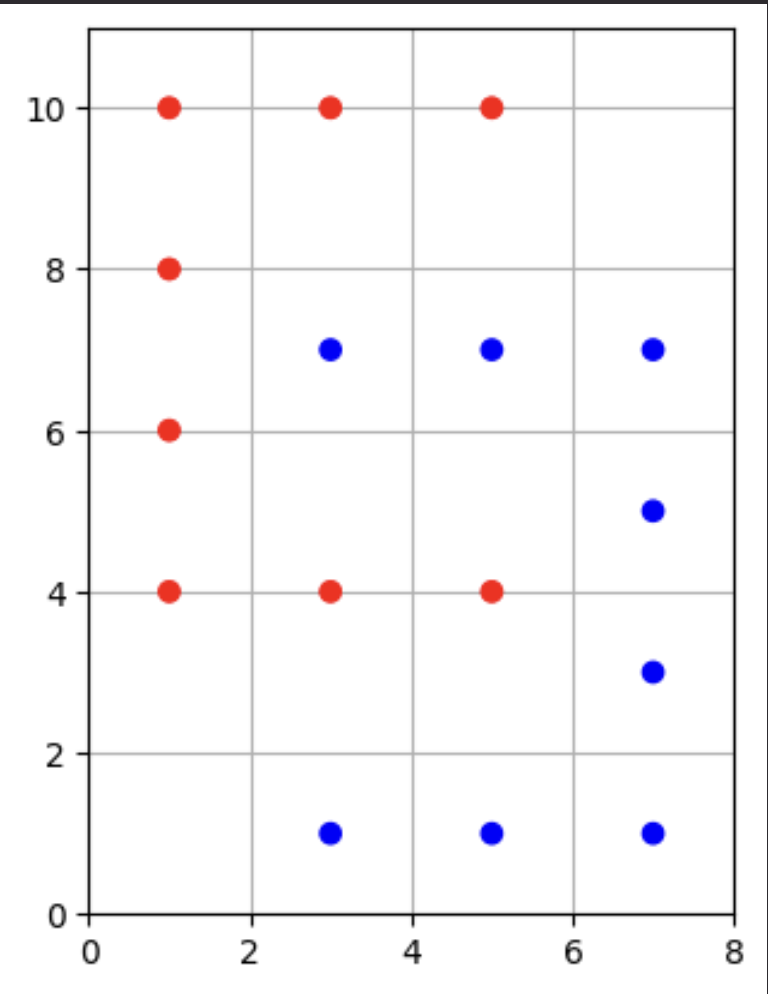
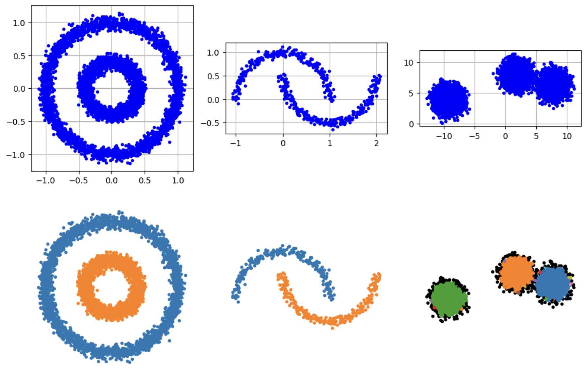
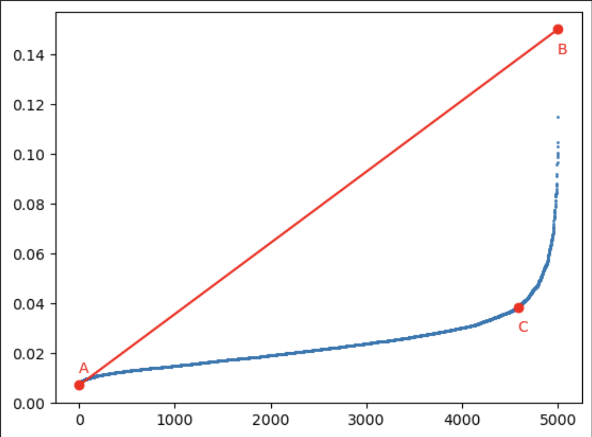
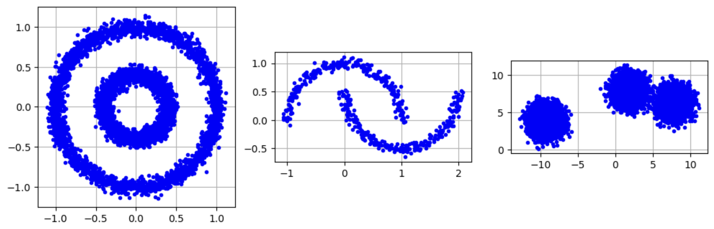
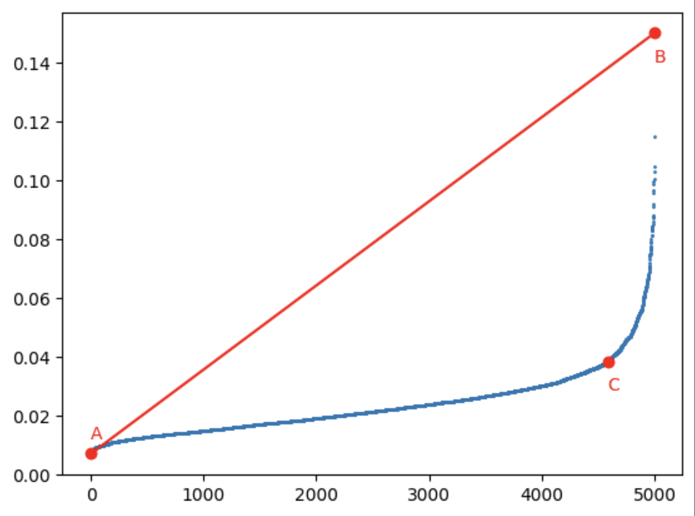
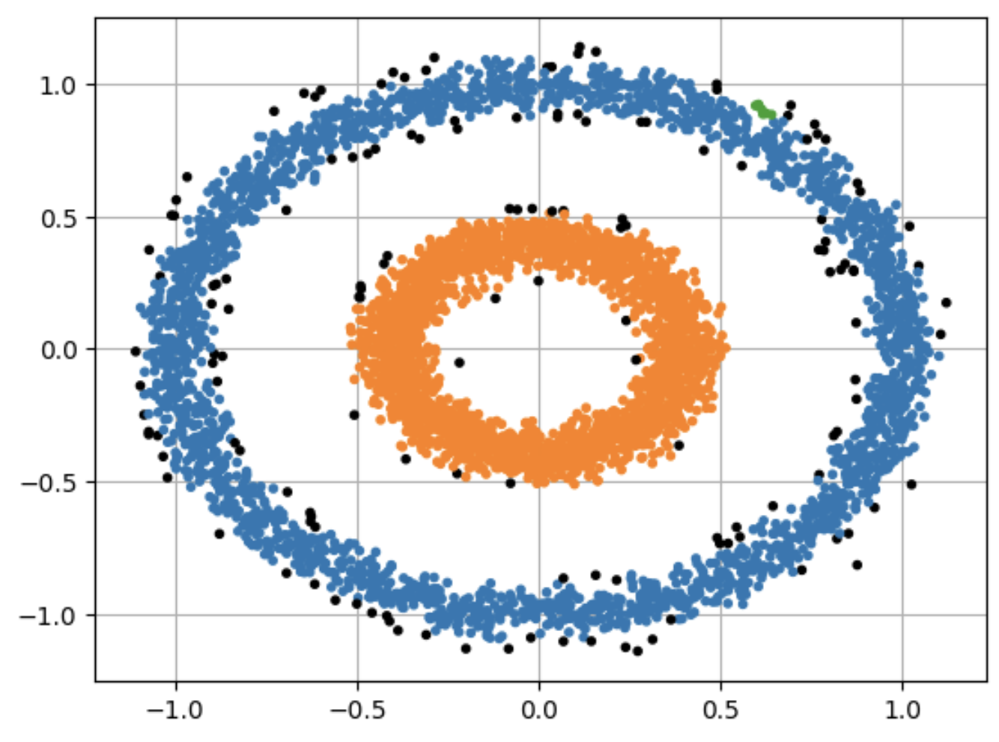

#DataMining 

## Definizioni
- **Core point**: un punto che ha almeno *min_pts* in un suo intorno eps
- **Border point**: un punto non core ma che è vicino ad un core
- **Noise point**: nè core, nè border



## Raggiungibilità 
- Un punto $p$ è **raggiungibile direttamente per densità** da $q$ se $q$ è un core e $p$ è nel suo vicinato. In questo caso $q$ **appartiene ad un cluster**
- Un punto $p$ è **raggiungibile per densità** da $q$ se esiste una catena di punti core a partire da $q$ ciascuno raggiungibile direttamente per densità dal precedente. In questo caso **tutti i core della catena sono punti di un unico cluster**
- I punti $p$ e $q$ sono connessi per densità se esiste un punto $u$ da cui $p$ e $q$ sono raggiungibili per densità


## Cluster
$C$ è un cluster, rispetto **min_pts** e **eps** se è non vuoto e soddisfa le seguenti proprietà:
- Per ogni coppia $p$ e $q$, se $q$ è in $C$ e $p$ è raggiungibile per densità da $q$, anche $p$ appartiene a $C$
- Ogni coppia $p$ e $q$ in $C$ deve essere connessa per densità. (Ovvero solo i punti raggiungibili per densità da un core in $C$ sono in $C$)

Dalla definizione, i border possono appartenere a più cluster perchè raggiungibili per densità da più core non vicini. L'algoritmo ne sceglierà uno e sara il primo a cui viene raggiunto


## L'Algoritmo

``` 
- INPUT: un insieme `D` di `n` punti, `eps`, `min_pts`
- OUTPUT: per ogni punto `p` in `D`, un valore `label[p]` in `{Noise, 0, 1, ...}`

* Inizializzazione: `label[p] ← non_visitato` per tutti i punti `p`
* Per ogni punto `p` in `D` etichettato `non_visitato`:
	1. Sia `N` l'insieme dei punti a distanza `≤ eps` da `p`
	2. Se `|N| < min_pts`, non è un core point, ma potrebbe diventare border. Per il momento
		- `label[p] ← Noise`

	3. Altrimenti `p` è un core di un nuovo cluster `c`, quindi
	* `label[p] ← c`
	* `S ← N - {p}`
	* Prosegui prelevando punti `q` da `S` fino ad esaurimento di quest'ultimo
		- Se `q` è già in un cluster, scartalo (se `label[q]` è un numero)
		- `label[q] ← c` anche se valeva `Noise`
		- Se `q` è un core point
			- Definisci `N` come l'insieme dei vicini di `q`
				- `S ← S ∪ (N - {q})`

```


## Implementazione

``` python

import matplotlib.pyplot as plt
import numpy as np

points = [(3,1), (5,1), (7,1), (7,3), (7,5), (7,7), (5,7), (3,7), (5,4), (3,4), (1,4), (1,6), (1,8), (1,10), (3,10), (5,10)]

fig, ax = plt.subplots(1, 1)

ax.scatter([x for x, _ in points], [y for _, y in points], color='blue', marker='o', zorder=3)

ax.set_xlim(0, 8)
ax.set_ylim(0, 11)
ax.set_aspect('equal')
ax.grid(True)
#ax.axis('off')
plt.show()

```





``` python
from scipy.spatial import KDTree

def dbscan(points, eps, min_pts):
    '''
    points: Una sequenza di punti, o qualsiasi struttura che possa essere interpretata coma una sequenza di punti
    eps: distanza massima per essere considerato vicino
    min_pts: numero di punti minimo di vicini per essere considerato core

    Ritorna una lista label tale che labels[i] in ('Noise', '0', '1', '2', '3',...) e descrive il cluster a cui appartiene il points[i]
    '''
    points = np.array(points)

    n = points.shape[0]
    tree = KDTree(points)

    c = -1  # c+1 sarà il 'nome' del prossimo cluster
    labels = [None]*n # non visitato

    for i, p in enumerate(points):
        if labels[i] != None:
            continue
        N = tree.query_ball_point(p, eps) # indici in points dei punti a distanza eps da p
        if len(N) < min_pts:
            labels[i] = 'Noise'
            continue

        c += 1

        labels[i] = str(c)

        # estensione
        S = set(N) - set([i]) # nel caso medio |N| è considerato costante
        while len(S) > 0:
            j = S.pop()
            if labels[j] == 'Noise': # non core
                labels[j] = str(c)
            if labels[j] != None: # non core, altrimenti i nel cluster
                continue
            labels[j] = str(c)
            N = tree.query_ball_point(points[j], eps)
            if len(N) < min_pts:
                continue
            S.update( set(N) - set([j]) )

    return labels


```


``` python
labels = dbscan(points, eps=2, min_pts=2)
print(labels)

['0', '0', '0', '0', '0', '0', '0', '0', '1', '1', '1', '1', '1', '1', '1', '1']
```

Rappresentiamo la soluzione graficamente definendo un array di colori per le due classi: 'blue' per '0', 'red' per '1'

``` python
points =  [(3,1), (5,1), (7,1), (7,3), (7,5), (7,7), (5,7), (3,7),
           (5,4), (3,4), (1,4), (1,6), (1,8), (1,10), (3,10), (5,10)]

fig, ax = plt.subplots(1, 1)


ax.scatter([x for x, _ in points], [y for _, y in points], color= ['blue' if v == '0' else 'red' for v in labels], marker='o', zorder=3)

ax.set_xlim(0, 8)
ax.set_ylim(0, 11)
ax.set_aspect('equal')
ax.grid(True)
#ax.axis('off')
plt.show()

```





Dataset random

``` python

from sklearn import datasets
import matplotlib.colors as mcolors

noisy_circles = datasets.make_circles(n_samples=5000, factor=0.4, noise=0.05, random_state=0)
noisy_moons = datasets.make_moons(n_samples=500, noise=0.05, random_state=0)
blobs = datasets.make_blobs(n_samples=15000, center_box=(-10,10), random_state=20)

fig, axs = plt.subplots(2, 3, figsize=(12,8))

for i, the_dataset in enumerate([noisy_circles, noisy_moons, blobs]): 
    points = the_dataset[0]
    ax = axs[0][i]
    ax.scatter([x for x, _ in points], [y for _, y in points], color= 'blue', marker='.', zorder=3)
    ax.grid(True)
    ax.set_aspect('equal')
    #ax.axis('off')

color_map = list(mcolors.TABLEAU_COLORS.keys())*10

for i, the_dataset in enumerate([noisy_circles, noisy_moons, blobs]): 
    points = the_dataset[0]
    labels = dbscan(points, eps=0.2, min_pts=4)
    ax = axs[1][i]
    colors = []
    for lab in labels:
        if lab == 'Noise':
            colors.append('black')
        else:
            colors.append(color_map[int(lab)])
    ax.scatter([x for x, _ in points], [y for _, y in points], color=colors, marker='.', zorder=3)
    ax.grid(True)
    ax.set_aspect('equal')
    ax.axis('off')

```





## Stima del parametro eps
Per stimare il valore ottimale di **eps**, ad ogni punto $p$ si associa la distanza dal punto più lontano tra i suoi **min_pts** vicini. Le distanze così ottenute vengono ordinate in modo crescente, ottenendo una curva che cresce lentamente all'inizio e poi aumenta bruscamente



I punti situati in zone dense presentano distanze piccole, mentre quelli in zone più isolate hanno distanze maggiori. Il punto in cui la curva cambia più nettamente, il cosiddetto **gomito**, indica il confine tra zone dense e rumore. Il valore della distanza in prossimità del gomito rappresenta un buon candidato per **eps**. 

Per individuarlo automaticamente, **si cerca il punto della curva che ha la massima distanza dalla retta che unisce gli estremi sinistro e destro della curva**, corrispondenti ai punti A e B nella figura

#### Esercizio 
Si utilizzi il metodo descritto per trovare il valore di **eps** consigliato per i tre dataset dell'esempio precedente

``` python

import numpy as np
from scipy.spatial import KDTree

def dbscan(points, eps, min_pts):
    '''
    points: Una sequenza di punti, o qualsiasi struttura che possa essere interpretata coma una sequenza di punti
    eps: distanza massima per essere considerato vicino
    min_pts: numero di punti minimo di vicini per essere considerato core

    Ritorna una lista label tale che labels[i] in ('Noise', '0', '1', '2', '3',...) e descrive il cluster a cui appartiene il points[i]
    '''
    points = np.array(points)

    n = points.shape[0]
    tree = KDTree(points)

    c = -1  # c+1 sarà il 'nome' del prossimo cluster
    labels = [None]*n

    for i, p in enumerate(points):
        if labels[i] != None:
            continue
        N = tree.query_ball_point(p, eps) # indici in points dei punti a distanza eps da p
        if len(N) < min_pts:
            labels[i] = 'Noise'
            continue

        c += 1

        labels[i] = str(c)

        # estensione
        S = set(N) - set([i]) # nel caso medio |N| è considerato costante
        while len(S) > 0:
            j = S.pop()
            if labels[j] == 'Noise':
                labels[j] = str(c)
            if labels[j] != None:
                continue
            labels[j] = str(c)
            N = tree.query_ball_point(points[j], eps)
            if len(N) < min_pts:
                continue
            S = S.union(set(N) - set([j])) # costo lineare in max(S, |N|)
            # S.update( set(N) - set([j]) )  # meglio usare questa: costo lineare in |N|, quindi costante nel caso medio

    return labels

```


``` python
from sklearn import datasets
import matplotlib.colors as mcolors
import matplotlib.pyplot as plt 

noisy_circles = datasets.make_circles(n_samples=5000, factor=0.4, noise=0.05, random_state=0)
noisy_moons = datasets.make_moons(n_samples=500, noise=0.05, random_state=0)
blobs = datasets.make_blobs(n_samples=15000, center_box=(-10,10), random_state=20)

fig, axs = plt.subplots(1, 3, figsize=(12,8))

for i, the_dataset in enumerate([noisy_circles, noisy_moons, blobs]): 
    points = the_dataset[0]
    ax = axs[i]
    ax.scatter([x for x, _ in points], [y for _, y in points], color= 'blue', marker='.', zorder=3)
    ax.grid(True)
    ax.set_aspect('equal')
    #ax.axis('off')

```




``` python
points = noisy_circles[0]
tree = KDTree(points)

min_pts = 6 # 5 effettivo, se viene tolto il punto stesso

# per ogni punto, la distanza dal punto più lontano nel suo k-vicinato
k_dists =[]

for p in points:
    N =tree.query(p, k = min_pts)
    min_pts_dist = N[0][-1]
    k_dists.append(min_pts_dist)

k_dists.sort()

```

Per il calcolo della distanza di un punto $P$ alla retta passante per A e B si usa la formula
$$d = \frac{||AB \cdot AP||}{||AB||}$$
dove $||AB \cdot ||AP||$ indica il prodotto vettoriale tra i vettori $B - A$ e $P - A$ che in numpy è rappresentato dalla funzione **cross**

``` python
A = np.array([0.0, k_dists[0]])
B = np.array([len(k_dists)-1, k_dists[-1]])

# distanza dei punti in k_dists dalla retta AB
dist_AB = []
for i, d in enumerate(k_dists):
    p = np.array( [1.0*i,d] ) # il punto nel grafico k_dist
    dist_AB.append( [ np.abs(np.cross(A - B, A - p))  / np.linalg.norm(A - B), # distanza di p dalla retta
                     d ] ) # k_distanza, potenziale eps
    
max_idx = np.argmax(dist_AB, axis=0)[0] # indice che massimizza la prima componente delle coppie in dist_AB
eps = dist_AB[max_idx][1]

print(eps)

```


``` python
# retta che unisce primo e ultimo punto in k_dits
plt.plot( [0, len(k_dists)-1], [k_dists[0], k_dists[-1]], c='red')

plt.scatter(np.arange(len(k_dists)), k_dists, s = 1)

plt.scatter(A[0], A[1], color='red')
plt.text(A[0]-1, A[1]+.005, 'A', color='red')
plt.scatter(B[0], B[1], color='red')
plt.text(B[0]-1, B[1]-.01, 'B', color='red')

# il punto più distante dalla retta
C = np.array( (1.0*max_idx, eps) )

plt.scatter(C[0], C[1], color='red')
plt.text(C[0]-1, C[1]-.01, 'C', color='red')

```





``` python
color_map = list(mcolors.TABLEAU_COLORS.keys())*10

labels = dbscan(points, eps=eps, min_pts=6)

colors = []
for lab in labels:
    if lab == 'Noise':
        colors.append('black')
    else:
        colors.append(color_map[int(lab)])
plt.scatter([x for x, _ in points], [y for _, y in points], color=colors, marker='.', zorder=3)
plt.grid(True)

```




