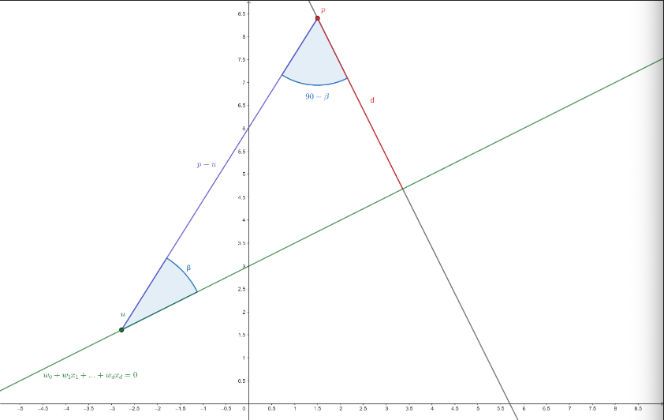
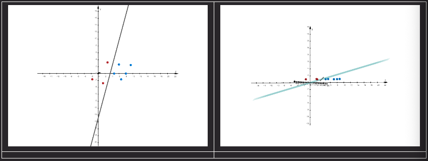
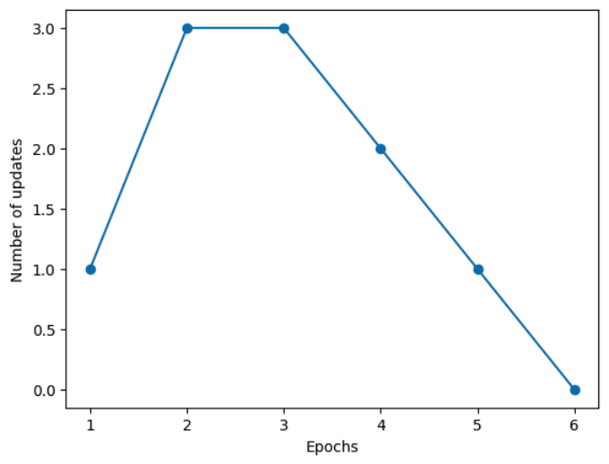
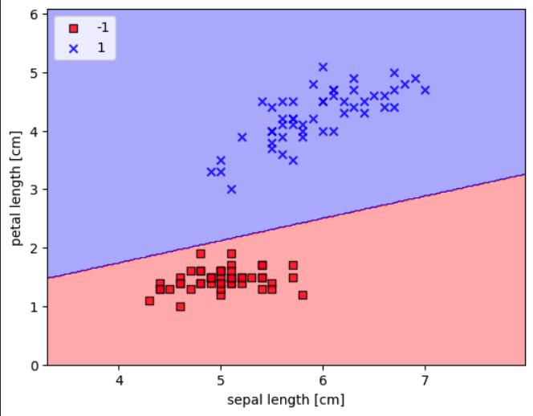

#DataMining 

## Notazioni
- $ X \in R^{nxd}$ **matrice delle caratteristiche**: $n$ esempi e $d$ caratteristiche
- $x^{(i)}$ è la riga $i$-esima di $X$
- $x_{j}^{(i)}$ è la caratteristica $j$-esima di $x^{(i)}$ 
- $y$ **vettore delle etichette** (output). Di dimensione $n$


## Neurone artificiale

>[!info] Ambito
>Classificazione **binaria**, due possibili classi -1 e 1

Il neurone prende in input un array $x = (x_{1}, ..., x_{d}) \in \mathbb{R}^{d}$ che stabilisce i valori delle $d$ feature e ritorna -1 o 1.

Implementa una funzione decisionale di tipo lineare: $x_{1}w_{1} + ... + x_{d}w_{d}$. Se tale valore è **maggiore di una soglia** $\Theta$, $x$ è classificato +1, altrimenti -1. Oppure introducendo $w_{0} = -\Theta$ e $x_{0} = 1$ se
$$x_{0}w_{0}+x_{1}w_{1}+...+x_{d}w_{d} \geq 0$$
L'esempio $x$ è classificato +1, altrimenti -1.

Passando al prodotto scalare:
$$x_{0}w_{0}+x_{1}w_{1}+...+x_{d}w_{d} = w \cdot x$$
dove $w$ e $x$ sono due **vettori**. Il valore $w_{0}$ è chiamato **bias unit** (unità di polarizzazione)

Una volta noti i pesi di $w$, il neurone artificiale applica la regola $\Phi(w \cdot x) = +1$ se $w \cdot x \geq 0$ altrimenti $\Phi(w \cdot x) = -1$. Il valore $w \cdot x$ è chiamato **input di rete**. I valori $w$, propri del neurone, devono essere trovati attraverso l'addestramento a partire da esempi classificati.


## Algoritmo Perceptron
Se $x$ è una variabile in $\mathbb{R}^{d}, w \cdot x = 0$ è un **iperpiano**. Addestrare un neurone artificiale equivale a trovare un iperpiano che partizioni gli esempi in modo che quelli della classe +1 siano nella parte positiva e quelli classificati -1 nella parte negativa. Sia $X \in \mathbb{R}^{nxd}$ la matrice degli $n$ esempi classificati e $y \in \{-1, 1\}^{n}$, il valore target

**Se gli $n$ esempi sono linearmente separabili, l'algoritmo perceptron trova il piano separatore.**

L'algoritmo Perceptron agisce come segue:
- Inizializza un ipotetico vettore di pesi $w$
- Per un numero massimo di epoche:
	- Testa $w$ su tutti gli esempi
	- Se non commette errori esce restituendo $w$, altrimenti se l'errore è su $x$
		- Aggiorna $w$ sommando ai pesi un valore che 'spinge' $w$ verso $x$

Si osservi che l'esempio $x^{(i)}$ è classificato corettamente se e solo se $y^{(i)} (w \cdot x^{(i)}) > 0$. Nel caso contrario aggiorniamo $w$ nel seguente modo:
$$w = w + \eta y^{(i)}x^{(i)}$$
dove $\eta$ è una **costante positiva nota come tasso di apprendimento**.


#### In Python
$X$, la **matrice di addestramento** è una struttura tipo array di $n$ righe e $d+1$ colonne; $y$, il **vettore delle etichette**, è un array di dimensione $n$.

``` python
'''
Parametri: X, matrice di addestramento; y, vettore etichette; eta, tasso di apprendimento;

La funzione dot della libreria numpy esegue il prodotto scalare
'''
        for _ in range(max_number_of_iters):
            errors = 0
            for xi, target in zip(X, y):
                if target*(np.dot(w[1:],xi) + w[0]) <= 0:
                    w_[1:] += eta*xi*target
                    w_[0]  +=  eta*target
                    errors += 1
            if errors == 0:
                break
```

``` python
import numpy as np

class Perceptron(object):
    """Perceptron classifier.

    Parameters
    ------------
    eta : float
      Learning rate (between 0.0 and 1.0)
    n_iter : int
      Passes over the training dataset.
    random_state : int
      Random number generator seed for random weight
      initialization.

    Attributes
    -----------
    w_ : 1d-array
      Weights after fitting.
    errors_ : list
      Number of misclassifications (updates) in each epoch.

    """
    def __init__(self, eta=0.01, n_iter=50, random_state=1):
        self.eta = eta
        self.n_iter = n_iter
        self.random_state = random_state

    def fit(self, X, y):
        """Fit training data.

        Parameters
        ----------
        X : {array-like}, shape = [n_examples, n_features]
          Training vectors, where n_examples is the number of examples and
          n_features is the number of features.
        y : array-like, shape = [n_examples]
          Target values.

        Returns
        -------
        self : object

        """
        rgen = np.random.RandomState(self.random_state)
        self.w_ = rgen.normal(loc=0.0, scale=0.01, size=1 + X.shape[1])
        self.errors_ = []

        for _ in range(self.n_iter):
            errors = 0
            for xi, target in zip(X, y):
                update = self.eta * (target - self.predict(xi))
                self.w_[1:] += update * xi
                self.w_[0] += update
                errors += int(update != 0.0)
            self.errors_.append(errors)
        return self

    def net_input(self, X):
        """Calculate net input"""
        return np.dot(X, self.w_[1:]) + self.w_[0]

    def predict(self, X):
        """Return class label after unit step"""
        return np.where(self.net_input(X) >= 0.0, 1, -1)

```


#### Dimostrazione di correttezza dell'algoritmo

###### Preliminari
Siano $a = (a_{1}, ..., a_{2})$ e $b = (b_{1}, ..., b_{d})$ due vettori
$$a \cdot b = a_{1}b_{1} +...+a_{d}b_{d}$$
è il **prodotto scalare** tra $a$ e $b$.

Mentre 
$$||a|| = \sqrt{a^{2}_{1} + ... + a_{d}^{2}}$$
è il **modulo** o **lunghezza** del vettore $a$.

###### Proprietà 1
Sia $\beta$ l'angolo tra due vettori $a$ e $b$, allora 
$$a \cdot b = ||a||\cdot||b|| \cos(\beta)$$
quindi due vettori sono perpendicolari se e solo se $a \cdot b = 0$


###### Proprietà 2
Si consideri un iperpiano così definito:
$$H : w_{0} + w_{1}x_{1} + ...+ w_{d}x_{d} = 0$$
Il vettore $(w_{1}, ..., w_{d})$ è perpendicolare ad $H$

**DIM**
Si dimostra che la proprietà vale per l'iperpiano $H' : w_{1}x_{1} + ... + w_{d}x_{d} = 0$ in quanto parallelo ad $H$

Siano $p$ un qualsiasi punto di $H'$, $p$ è un **vettore direzione** di $H'$ (e quindi anche di $H$). Essendo $p$ un punto in $H'$ vale $w \cdot p = 0$. Indichiamo con $\beta$ l'angolo tra $p$ (e quindi $H'$) e $w$, per la Proprietà 1
$$||w|| \cdot ||p|| \cos(\beta) = 0$$
Quindi $\beta$ deve valere $\pm 90$.

###### Proprietà 3 (distanza punto piano)
La distanza di un punto $p$ da un piano $H:w_{0} + w_{1}x_{1}+...+w_{d}x_{d} = 0$ vale
$$\frac{w \cdot p + w_{0}}{||w||}$$
**DIM**
Sia $u$ un qualsiasi punto del piano $H$, $w \cdot u = -w_{0}$. Denominiamo $\beta$ l'angolo formato da $H$ e il vettore $p-u$. La distanza $d$ da $p$ a $H$ è
$$d = ||p-u||\sin(\beta)$$


Applichiamo la Proprietà 1 ai vettori $p-u$ e $w$ (il vettore perpendicolare ad $H$, Proprietà 2)
$$\cos(90 - \beta) = \frac{w \cdot (p-u)}{||w|| \cdot ||p - u||} = \sin(\beta)$$
Sostituendo $\sin(\beta)$ nell'espressione di $d$
$$d = \frac{w \cdot (p - u)}{||w||} = \frac{w \cdot p - u \cdot u}{||w||} = \frac{w \cdot p + w_{0}}{||w||}$$

Sia $H$ l'iperpiano che separa gli esempi descritti dalla matrice $X \in \mathbb{R}^{mxd}$. Senza perdita di generalità si può assumere che $H$ passi per l'origine, ovvero sia della forma $w \cdot x = 0$. Infatti se così non fosse possiamo estendere in punti $X$ in uno spazio a $d+1$ dimensioni aggiungendo una coordinata costate uguale a 1 a tutti i punti. In questo modo i punti sono separabili da un piano passante per $H$ e per l'origine



Sia $w^*$ il vettore dei coeficienti di un iperpiano separatore e $w^{(k)}$ l'iperpiano generato al passo $k$ dell'algoritmo. Mostreremo che l'angolo tra $w^*$ e $w^{(k)}$ decresce al crescere di $k$.

Il **margine** di $w^*$ è il minimo tra le distanze degli esempi $x^{(i)}$ e il piano $w^*\cdot x =0$. Alla distanza punto piano si moltiplica l'etichetta dell'esempio. In questo modo un margine negativo indica un piano che non separa.
$$\gamma = \min_i \left\{ y^{i}\frac{w^*\cdot x^{(i)}}{\|w^*\|} \right\}.$$
Sia inoltre $U$ un limite superiore alla norma di tutti gli $x^{(i)}$.
$$U \geq \max_i \| x^{(i)} \|$$
Tornando all'algoritmo, supponiamo di assegnare $(0,\ldots, 0)$ a $w^{(0)}$ (la prima soluzione parziale definita dall'algoritmo). Inoltre assumiamo che al passo $k$ venga aggiornato $w$ nel seguente modo
$$w^{(k)} = w^{(k-1)}+ \eta y^{(i)} x^{(i)}$$
allora, dall'algoritmo e dalla proprietà del margine
$$y^{(i)} w^{(k-1)}\cdot x^{(i)} \leq 0 < \gamma \leq y^{(i)}\frac{w^* \cdot x^{(i)}}{\| w^* \| }$$
Dalla proprietà del prodotto scalare
$$\cos(\beta) = \frac{w^* \cdot w^{(k)} }{\|w^*\|
\|w^{(k)}\|} = \frac{w^* \cdot w^{(k)} }{\|w^*\|} \frac{1}{\|w^{(k)}\|}$$
Ricordando la regola di aggiornamento
$$\frac{w^* \cdot w^{(k)} }{\|w^*\|} = \frac{w^* \cdot w^{(k-1)} + \eta y^{(i)}x^{(i)}\cdot w^* }{\|w^*\|}
= \frac{w^* w^{(k-1)}}{\|w^*\|} + \eta\frac{y^{(i)}x^{(i)}\cdot w^* }{\|w^*\|}\geq \frac{w^* w^{(k-1)}}{\|w^*\|} +\eta \gamma$$
Ripetendo per tutti i $k$
$$\frac{w^* \cdot w^{(k)} }{\|w^*\|} \geq \frac{w^* w^{(k-1)}}{\|w^*\|} +\eta \gamma \geq \frac{w ^* w^{(k-2)}}{\|w^*\|} +2\eta \gamma \geq \ldots \geq \frac{w^* w^{(0)}}{\|w^*\|} + k\eta \gamma$$
Tenendo conto che $w^{(0)} = (0,\ldots, 0)$
$$\frac{w^* \cdot w^{(k)} }{\|w^*\|} \geq k\eta\gamma > 0.$$
Passiamo al secondo fattore che definisce $\cos(\beta)$ ovvero $1/\|w^{(k)}\|$. Dalla regola di aggiornamento
$$\|w^{(k)}\|^2 = \|w^{(k-1)} + \eta y^{(i)} x^{(i)}\|^2$$
Se $a$ e $b$ sono due vettori di pari dimensione $d$, si ha $\|a+b\|^2 = \|a\|^2 + 2a\cdot b + \|b\|^2$. La dimostrazione è immediata:
$$\|a+b\|^2 = (a_1 + b_1)^2 +\ldots + (a_d + b_d)^2 $$
$$= a_1^2+\ldots+a_d^2 + 2a_1b_1 +\ldots+2a_d b_d + b_1^2+\ldots+b_d^2$$
$$= \|a\|^2 + 2 a\cdot b + \|b\|^2$$
Quindi
$$\|w^{(k)}\|^2 = \|w^{(k-1)}\|^2 + 2 \eta y^{(i)} x^{(i)}\cdot w^{(k-1)} + \| \eta y^{(i)} x^{(i)} \|^2$$
Il secondo termine è $\leq 0$ per via della regola di aggiornamento dei pesi; il terzo termine vale $\eta^2 \| x^{(i)} \|^2$ che, usando la definizone di $U$, è $\leq (\eta U)^2$. Tornando a $\|w^{(k)}\|^2$

$$\|w^{(k)}\|^2 \leq \|w^{(k-1)}\|^2 + \eta^2 U^2 \leq \|w^{(k-2)}\|^2 + 2\eta^2 U^2 \leq \ldots \leq \|w^{(0)}\|^2 + k\eta^2 U^2 = k\eta^2 U^2.$$
Da cui
$$1 \geq \cos(\beta) \geq \frac{k\eta\gamma}{\eta U\sqrt{k}} = \frac{\gamma\sqrt{k}}{U} > 0$$

L'ultimo valore cresce al crescere di $k$ e, per la relazione descritta sopra, tende a $1$ di conseguenza tende a $1$ il $\cos(\beta)$, pertanto $\beta$ tende a $0$.

Si osservi anche che la relazione precedente ci dice che l'ultimo termine della catena sarà $1$ quando $\sqrt{k} = U/\gamma$. Ovvero l'algoritmo converge in al più $U^2/\gamma^2$ passi.


## Codice

``` python
from matplotlib.colors import ListedColormap

'''
Funzione di utilità per mostrare le regioni di decisione
'''

def plot_decision_regions(X, y, classifier, resolution=0.02):

    # setup marker generator and color map
    markers = ('s', 'x', 'o', '^', 'v')
    colors = ('red', 'blue', 'lightgreen', 'gray', 'cyan')
    cmap = ListedColormap(colors[:len(np.unique(y))])

    # plot the decision surface
    x1_min, x1_max = X[:, 0].min() - 1, X[:, 0].max() + 1
    x2_min, x2_max = X[:, 1].min() - 1, X[:, 1].max() + 1
    xx1, xx2 = np.meshgrid(np.arange(x1_min, x1_max, resolution),
                           np.arange(x2_min, x2_max, resolution))
    Z = classifier.predict(np.array([xx1.ravel(), xx2.ravel()]).T)
    Z = Z.reshape(xx1.shape)
    plt.contourf(xx1, xx2, Z, alpha=0.3, cmap=cmap)
    plt.xlim(xx1.min(), xx1.max())
    plt.ylim(xx2.min(), xx2.max())

    # plot class examples
    for idx, cl in enumerate(np.unique(y)):
        plt.scatter(x=X[y == cl, 0], 
                    y=X[y == cl, 1],
                    alpha=0.8, 
                    c=colors[idx],
                    marker=markers[idx], 
                    label=cl, 
                    edgecolor='black')
        
# In[]

import numpy as np


class Perceptron(object):
    """Perceptron classifier.

    Parameters
    ------------
    eta : float
      Learning rate (between 0.0 and 1.0)
    n_iter : int
      Passes over the training dataset.
    random_state : int
      Random number generator seed for random weight
      initialization.

    Attributes
    -----------
    w_ : 1d-array
      Weights after fitting.
    errors_ : list
      Number of misclassifications (updates) in each epoch.

    """
    def __init__(self, eta=0.01, n_iter=50, random_state=1):
        self.eta = eta
        self.n_iter = n_iter
        self.random_state = random_state

    def fit(self, X, y):
        """Fit training data.

        Parameters
        ----------
        X : {array-like}, shape = [n_examples, n_features]
          Training vectors, where n_examples is the number of examples and
          n_features is the number of features.
        y : array-like, shape = [n_examples]
          Target values.

        Returns
        -------
        self : object

        """
        rgen = np.random.RandomState(self.random_state)
        self.w_ = rgen.normal(loc=0.0, scale=0.01, size=1 + X.shape[1])
        self.errors_ = []

        for _ in range(self.n_iter):
            errors = 0
            for xi, target in zip(X, y):
                if target*self.net_input(xi) <= 0:
                    self.w_[1:] += self.eta*xi*target
                    self.w_[0] += self.eta*target
                    errors += 1
            self.errors_.append(errors)
            if errors == 0:
                break
        return self

    def net_input(self, x):
        """Calculate net input, input di rete"""
        return np.dot(x, self.w_[1:]) + self.w_[0]

    def predict(self, x):
        """Return class label after unit step"""
        return np.where(self.net_input(x) >= 0.0, 1, -1)
```


```python
'''
Importiamo il dataset iris in un DataFrame Pandas
'''
import os
import pandas as pd
import matplotlib.pyplot as plt

s = os.path.join('dataset', '01-02-iris.csv')
df = pd.read_csv(s,
                 header=None,
                 encoding='utf-8')

df

```

```python
# select setosa and versicolor
y = df.iloc[0:100, 4].values
y = np.where(y == 'Iris-setosa', -1, 1)

# extract sepal length and petal length
X = df.iloc[0:100, [0, 2]].values

'''
Provare a modificare gli iperparametri eta e n_iter
'''

ppn = Perceptron(eta=0.001, n_iter=100)

ppn.fit(X, y)

plt.plot(range(1, len(ppn.errors_) + 1), ppn.errors_, marker='o')
plt.xlabel('Epochs')
plt.ylabel('Number of updates')

# plt.savefig('images/02_07.png', dpi=300)
plt.show()

plot_decision_regions(X, y, classifier=ppn)
plt.xlabel('sepal length [cm]')
plt.ylabel('petal length [cm]')
plt.legend(loc='upper left')


```





