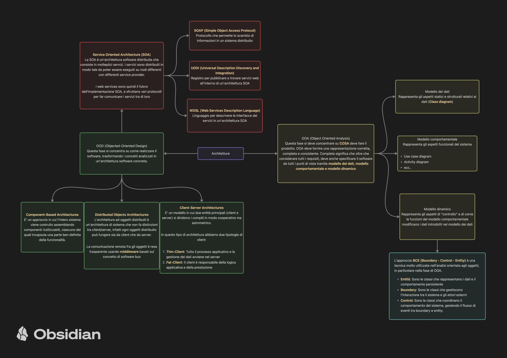

#Software 

Ho cercato di sintetizzare la maggior parte degli argomenti di ISW

#### Architetture

#### Ciclo di vita SW

#### Design Pattern

#### Metriche di Struttura

#### Modelli 

#### Risk Analysis

faccio una prova
#### Testing 

